# Complete DDD Framework Flow

This document contains Mermaid diagrams showing the complete DDD (Document-Driven Development) framework with all passes, steps, and phases including ID detection and relationship validation.

## Complete DDD Framework Flow

```mermaid
flowchart TD
    START[DDD Project Start] --> STEP0[Step 0: Requirements Pass]

    STEP0 --> REQ1[Analyze Business Requirements]
    REQ1 --> REQ2[Create REQUIREMENTS.md]
    REQ2 --> REQ3[Define REQ-NNNN Identifiers]
    REQ3 --> REQ4[Validate Requirements Coverage]
    REQ4 --> STEP1{Requirements Complete?}
    STEP1 -->|No| REQ1
    STEP1 -->|Yes| FOUNDATION

    FOUNDATION[Step 1: Foundation Pass] --> FOUND1[Setup .agent3d-config.yml]
    FOUND1 --> FOUND2[Initialize Documentation Structure]
    FOUND2 --> FOUND3[Create FEATURES.md Template]
    FOUND3 --> FOUND4[Create TEST-CASES.md Template]
    FOUND4 --> FOUND5[Setup Identifier Patterns]
    FOUND5 --> FOUND6[Initialize Traceability Matrix]
    FOUND6 --> STEP2{Foundation Complete?}
    STEP2 -->|No| FOUND1
    STEP2 -->|Yes| DEVELOPMENT

    DEVELOPMENT[Step 2: Development Pass] --> DEV_PLAN[Sub-Pass 1: Planning]
    DEV_PLAN --> PLAN1[Create Feature Specifications]
    PLAN1 --> PLAN2[Define FT-NNNN Identifiers]
    PLAN2 --> PLAN3[Link Features to Requirements]
    PLAN3 --> PLAN4[Create Test Case Specifications]
    PLAN4 --> PLAN5[Define TC-NNNN Identifiers]
    PLAN5 --> PLAN6[Link Test Cases to Features]
    PLAN6 --> DEV_IMPL{Planning Complete?}

    DEV_IMPL -->|No| PLAN1
    DEV_IMPL -->|Yes| IMPL1[Sub-Pass 2: Implementation]
    IMPL1 --> IMPL2[Implement Features]
    IMPL2 --> IMPL3[Add FT-NNNN Comments to Code]
    IMPL3 --> IMPL4[Create Test Files]
    IMPL4 --> IMPL5[Implement TC-NNNN Tests]
    IMPL5 --> IMPL6[Validate Test Quality]
    IMPL6 --> DEV_TEST{Implementation Complete?}

    DEV_TEST -->|No| IMPL2
    DEV_TEST -->|Yes| TEST1[Sub-Pass 3: Testing]
    TEST1 --> TEST2[Run All Tests]
    TEST2 --> TEST3[Validate Coverage]
    TEST3 --> TEST4[Check Test Quality]
    TEST4 --> TEST5[Verify TC-FT Mapping]
    TEST5 --> STEP3{Development Complete?}
    STEP3 -->|No| DEV_PLAN
    STEP3 -->|Yes| SYNC

    SYNC[Step 3: Synchronization Pass] --> SYNC1[Scan All Documentation]
    SYNC1 --> SYNC2[Extract All Identifiers]
    SYNC2 --> SYNC3[Validate Relationships]
    SYNC3 --> SYNC4[Check Drift Issues]
    SYNC4 --> SYNC5[Generate Drift Reports]
    SYNC5 --> SYNC6{Sync Issues Found?}
    SYNC6 -->|Yes| SYNC7[Fix Drift Issues]
    SYNC7 --> SYNC1
    SYNC6 -->|No| STEP4
    STEP4[Synchronization Complete] --> REVIEW

    REVIEW[Step 4: Code Review Pass] --> REVIEW1[Language-Specific Review]
    REVIEW1 --> REVIEW2[Test Quality Review]
    REVIEW2 --> REVIEW3[Documentation Review]
    REVIEW3 --> REVIEW4[Architecture Review]
    REVIEW4 --> REVIEW5{Review Issues Found?}
    REVIEW5 -->|Yes| REVIEW6[Address Review Issues]
    REVIEW6 --> REVIEW1
    REVIEW5 -->|No| STEP5
    STEP5[Review Complete] --> REFACTOR

    REFACTOR[Step 5: Refactoring Pass] --> REFACT1[Identify Duplication]
    REFACT1 --> REFACT2[Apply DRY Principles]
    REFACT2 --> REFACT3[Horizontal Merging]
    REFACT3 --> REFACT4[Modularization]
    REFACT4 --> REFACT5[Update Documentation]
    REFACT5 --> STEP6{Refactoring Complete?}
    STEP6 -->|No| REFACT1
    STEP6 -->|Yes| FINAL

    FINAL[Step 6: Documentation Pass] --> DOC1[Compress Documentation]
    DOC1 --> DOC2[Remove Redundancy]
    DOC2 --> DOC3[Update Cross-References]
    DOC3 --> DOC4[Validate Markdown]
    DOC4 --> DOC5[Generate Final Reports]
    DOC5 --> COMPLETE[DDD Complete]

    %% Styling
    classDef stepClass fill:#e3f2fd,stroke:#1976d2,stroke-width:3px
    classDef reqClass fill:#e8f5e8,stroke:#388e3c,stroke-width:2px
    classDef foundClass fill:#fff3e0,stroke:#f57c00,stroke-width:2px
    classDef devClass fill:#fce4ec,stroke:#c2185b,stroke-width:2px
    classDef syncClass fill:#f3e5f5,stroke:#9c27b0,stroke-width:2px
    classDef reviewClass fill:#e0f2f1,stroke:#00695c,stroke-width:2px
    classDef refactClass fill:#fff8e1,stroke:#f9a825,stroke-width:2px
    classDef docClass fill:#e8eaf6,stroke:#5e35b1,stroke-width:2px
    classDef decisionClass fill:#ffebee,stroke:#d32f2f,stroke-width:2px
    classDef completeClass fill:#e8f5e8,stroke:#4caf50,stroke-width:3px

    class START,STEP0,FOUNDATION,DEVELOPMENT,SYNC,REVIEW,REFACTOR,FINAL stepClass
    class REQ1,REQ2,REQ3,REQ4 reqClass
    class FOUND1,FOUND2,FOUND3,FOUND4,FOUND5,FOUND6 foundClass
    class DEV_PLAN,PLAN1,PLAN2,PLAN3,PLAN4,PLAN5,PLAN6,IMPL1,IMPL2,IMPL3,IMPL4,IMPL5,IMPL6,TEST1,TEST2,TEST3,TEST4,TEST5 devClass
    class SYNC1,SYNC2,SYNC3,SYNC4,SYNC5,SYNC7 syncClass
    class REVIEW1,REVIEW2,REVIEW3,REVIEW4,REVIEW6 reviewClass
    class REFACT1,REFACT2,REFACT3,REFACT4,REFACT5 refactClass
    class DOC1,DOC2,DOC3,DOC4,DOC5 docClass
    class STEP1,STEP2,DEV_IMPL,DEV_TEST,STEP3,SYNC6,STEP4,REVIEW5,STEP5,STEP6 decisionClass
    class COMPLETE completeClass
```



## DDD Phases and Deliverables Overview

```mermaid
graph LR
    subgraph "Step 0: Requirements Pass"
        REQ_IN[Business Requirements] --> REQ_OUT[REQUIREMENTS.md<br/>REQ-NNNN IDs]
    end

    subgraph "Step 1: Foundation Pass"
        FOUND_IN[Project Setup] --> FOUND_OUT[.agent3d-config.yml<br/>Documentation Structure<br/>Templates]
    end

    subgraph "Step 2: Development Pass"
        DEV_IN[Requirements] --> DEV_PLAN_OUT[FEATURES.md<br/>FT-NNNN IDs]
        DEV_PLAN_OUT --> DEV_IMPL_OUT[Feature Code<br/>FT Comments]
        DEV_IMPL_OUT --> DEV_TEST_OUT[TEST-CASES.md<br/>TC-NNNN Tests]
    end

    subgraph "Step 3: Synchronization Pass"
        SYNC_IN[All Documentation] --> SYNC_OUT[Drift Reports<br/>Traceability Matrix<br/>Issue Fixes]
    end

    subgraph "Step 4: Code Review Pass"
        REVIEW_IN[Code + Tests] --> REVIEW_OUT[Review Reports<br/>Quality Fixes<br/>Standards Compliance]
    end

    subgraph "Step 5: Refactoring Pass"
        REFACT_IN[Working Code] --> REFACT_OUT[DRY Code<br/>Modular Architecture<br/>Updated Docs]
    end

    subgraph "Step 6: Documentation Pass"
        DOC_IN[Complete System] --> DOC_OUT[Compressed Docs<br/>Final Reports<br/>Clean References]
    end

    REQ_OUT --> FOUND_IN
    FOUND_OUT --> DEV_IN
    DEV_TEST_OUT --> SYNC_IN
    SYNC_OUT --> REVIEW_IN
    REVIEW_OUT --> REFACT_IN
    REFACT_OUT --> DOC_IN

    %% Styling
    classDef inputClass fill:#e8f5e8,stroke:#4caf50,stroke-width:2px
    classDef outputClass fill:#e3f2fd,stroke:#1976d2,stroke-width:2px
    classDef flowClass fill:#f3e5f5,stroke:#9c27b0,stroke-width:2px

    class REQ_IN,FOUND_IN,DEV_IN,SYNC_IN,REVIEW_IN,REFACT_IN,DOC_IN inputClass
    class REQ_OUT,FOUND_OUT,DEV_PLAN_OUT,DEV_IMPL_OUT,DEV_TEST_OUT,SYNC_OUT,REVIEW_OUT,REFACT_OUT,DOC_OUT outputClass
```



## Detailed Detection and Validation Flow

```mermaid
graph TD
    A[DDD Pass Start] --> B[Scan TEST-CASES.md]
    B --> C[Parse TC-ID Pattern: TC-NNNN]

    C --> D{TC-ID Found?}
    D -->|Yes| E[Extract TC Details]
    D -->|No| F[Skip Entry]

    E --> G[Analyze TC Description]
    G --> H[Search for FT Link Patterns]

    H --> I{Pattern: 'Links to FT-NNNN'<br/>or '[FT-NNNN]'?}
    I -->|Yes| J[Extract FT-NNNN]
    I -->|No| K[Search FEATURES.md<br/>for TC Reference]

    J --> L[Validate FT Exists]
    K --> M{TC Found in<br/>FEATURES.md?}
    M -->|Yes| N[Extract FT-NNNN from Context]
    M -->|No| O[Flag: Missing FT Link]

    L --> P{FT Exists?}
    P -->|Yes| Q[Search for REQ Links]
    P -->|No| R[Flag: Broken FT Link]

    N --> Q
    O --> Q
    R --> Q

    Q --> S{Pattern: 'REQ-NNNN'<br/>in TC or FT?}
    S -->|Yes| T[Extract REQ-NNNN]
    S -->|No| U[Search REQUIREMENTS.md]

    T --> V[Validate REQ Exists]
    U --> W{TC/FT Found in<br/>REQUIREMENTS.md?}
    W -->|Yes| X[Extract REQ-NNNN from Context]
    W -->|No| Y[Flag: Missing REQ Link]

    V --> Z{REQ Exists?}
    Z -->|Yes| AA[Build Traceability Chain]
    Z -->|No| BB[Flag: Broken REQ Link]

    X --> AA
    Y --> AA
    BB --> AA

    AA --> CC[REQ-NNNN ↔ FT-NNNN ↔ TC-NNNN]
    CC --> DD[Validate Test Implementation]

    DD --> EE{Test File Exists<br/>with TC-NNNN?}
    EE -->|Yes| FF[Validate Test Quality]
    EE -->|No| GG[Flag: Missing Test]

    FF --> HH{Quality Checks Pass?}
    HH -->|Yes| II[Mark: Complete Chain]
    HH -->|No| JJ[Flag: Quality Issues]

    GG --> KK[Generate Drift Report]
    JJ --> KK
    II --> LL[Update Traceability Matrix]

    KK --> MM[Action Items]
    LL --> NN[Success Report]

    MM --> OO[End]
    NN --> OO
    F --> OO

    %% Styling
    classDef tcStyle fill:#e3f2fd,stroke:#1976d2,stroke-width:2px
    classDef ftStyle fill:#fce4ec,stroke:#c2185b,stroke-width:2px
    classDef reqStyle fill:#e8f5e8,stroke:#388e3c,stroke-width:2px
    classDef errorStyle fill:#ffebee,stroke:#d32f2f,stroke-width:2px
    classDef successStyle fill:#e8f5e8,stroke:#4caf50,stroke-width:2px
    classDef processStyle fill:#fff3e0,stroke:#f57c00,stroke-width:2px

    class C,D,E,G tcStyle
    class I,J,L,P,N ftStyle
    class S,T,V,Z,X reqStyle
    class O,R,Y,BB,GG,JJ,KK,MM errorStyle
    class II,LL,NN successStyle
    class A,B,H,Q,U,W,AA,CC,DD,EE,FF,HH,OO processStyle
```

## ID Pattern Detection and Data Structures

```mermaid
graph LR
    subgraph "Input Sources"
        A[TEST-CASES.md]
        B[FEATURES.md]
        C[REQUIREMENTS.md]
        D[Test Files]
    end

    subgraph "ID Pattern Detection"
        E[TC-ID Regex:<br/>TC-[A-Z]+-\d+(-[a-z])?]
        F[FT-ID Regex:<br/>FT-[A-Z]+-\d+(-[a-z])?]
        G[REQ-ID Regex:<br/>REQ-[A-Z]+-\d+(-[a-z])?]
    end

    subgraph "Link Detection Patterns"
        H["'Links to FT-NNNN'<br/>'[FT-NNNN]'<br/>'See FT-NNNN'"]
        I["'Implements REQ-NNNN'<br/>'[REQ-NNNN]'<br/>'Satisfies REQ-NNNN'"]
        J["'TC-NNNN validates'<br/>'Tests: TC-NNNN'<br/>'@TC-NNNN'"]
    end

    subgraph "Relationship Matrix"
        K[REQ-CORE-001]
        L[FT-AUTH-001]
        M[TC-AUTH-001]
        N[test_auth_login_tc_001.py]

        K -.->|implements| L
        L -.->|tested by| M
        M -.->|code in| N
    end

    subgraph "Validation Checks"
        O[ID Exists?]
        P[Link Valid?]
        Q[Test Implements?]
        R[Quality Pass?]
    end

    subgraph "Output Reports"
        S[Traceability Matrix]
        T[Drift Report]
        U[Missing Links]
        V[Quality Issues]
    end

    A --> E
    B --> F
    C --> G
    D --> E

    E --> H
    F --> I
    G --> J

    H --> K
    I --> L
    J --> M

    K --> O
    L --> P
    M --> Q
    N --> R

    O --> S
    P --> T
    Q --> U
    R --> V

    %% Styling
    classDef inputStyle fill:#e8eaf6,stroke:#3f51b5,stroke-width:2px
    classDef patternStyle fill:#fff3e0,stroke:#ff9800,stroke-width:2px
    classDef linkStyle fill:#f3e5f5,stroke:#9c27b0,stroke-width:2px
    classDef matrixStyle fill:#e0f2f1,stroke:#009688,stroke-width:2px
    classDef validationStyle fill:#fff8e1,stroke:#ffc107,stroke-width:2px
    classDef outputStyle fill:#e8f5e8,stroke:#4caf50,stroke-width:2px

    class A,B,C,D inputStyle
    class E,F,G patternStyle
    class H,I,J linkStyle
    class K,L,M,N matrixStyle
    class O,P,Q,R validationStyle
    class S,T,U,V outputStyle
```

## Key Detection Patterns

### TC-ID Detection
- **Pattern**: `TC-[A-Z]+-\d+(-[a-z])?`
- **Examples**: TC-AUTH-001, TC-HTTP-003-a, TC-CORE-005
- **Sources**: TEST-CASES.md, test files, documentation

### FT-ID Detection
- **Pattern**: `FT-[A-Z]+-\d+(-[a-z])?`
- **Examples**: FT-AUTH-001, FT-HTTP-003, FT-CORE-005-a
- **Link Phrases**:
  - "Links to FT-NNNN"
  - "[FT-NNNN]"
  - "See FT-NNNN"
  - "Implements FT-NNNN"

### REQ-ID Detection
- **Pattern**: `REQ-[A-Z]+-\d+(-[a-z])?`
- **Examples**: REQ-CORE-001, REQ-AUTH-002, REQ-HTTP-003-b
- **Link Phrases**:
  - "Implements REQ-NNNN"
  - "[REQ-NNNN]"
  - "Satisfies REQ-NNNN"
  - "Addresses REQ-NNNN"

## Relationship Validation Process

1. **ID Extraction**: Parse documents using regex patterns to find all identifiers
2. **Link Detection**: Search for relationship phrases and cross-references
3. **Existence Validation**: Verify that all referenced IDs actually exist in their respective documents
4. **Chain Building**: Construct complete traceability chains (REQ → FT → TC → Test)
5. **Quality Validation**: Ensure test implementations meet quality standards
6. **Report Generation**: Create drift reports and traceability matrices

## Output Reports

- **Traceability Matrix**: Complete mapping of REQ ↔ FT ↔ TC ↔ Test relationships
- **Drift Report**: Missing links, broken references, and validation failures
- **Missing Links**: Unlinked TCs, FTs without requirements, tests without TCs
- **Quality Issues**: Test quality failures, missing implementations, poor coverage

## Complete DDD Framework Overview

### **Step 0: Requirements Pass**
- **Purpose**: Analyze and document business requirements
- **Deliverables**: REQUIREMENTS.md with REQ-NNNN identifiers
- **Key Activities**: Requirements gathering, analysis, validation, and documentation

### **Step 1: Foundation Pass**
- **Purpose**: Setup project structure and DDD framework
- **Deliverables**: .agent3d-config.yml, documentation templates, identifier patterns
- **Key Activities**: Project initialization, template creation, configuration setup

### **Step 2: Development Pass (3 Sub-Passes)**
- **Sub-Pass 1 - Planning**: Create feature specifications and test case definitions
- **Sub-Pass 2 - Implementation**: Implement features and create test files
- **Sub-Pass 3 - Testing**: Execute tests, validate coverage, and ensure quality
- **Deliverables**: FEATURES.md (FT-NNNN), TEST-CASES.md (TC-NNNN), working code and tests

### **Step 3: Synchronization Pass**
- **Purpose**: Validate all relationships and detect drift
- **Deliverables**: Drift reports, traceability matrix, issue fixes
- **Key Activities**: ID detection, relationship validation, drift scanning

### **Step 4: Code Review Pass**
- **Purpose**: Ensure code quality and standards compliance
- **Deliverables**: Review reports, quality fixes, standards compliance
- **Key Activities**: Language-specific review, test quality review, documentation review

### **Step 5: Refactoring Pass**
- **Purpose**: Improve code structure and eliminate duplication
- **Deliverables**: DRY code, modular architecture, updated documentation
- **Key Activities**: DRY principles, horizontal merging, modularization

### **Step 6: Documentation Pass**
- **Purpose**: Finalize and compress documentation
- **Deliverables**: Compressed docs, final reports, clean references
- **Key Activities**: Documentation compression, redundancy removal, final validation

## ID Detection Usage Across Passes

These ID detection diagrams are used throughout the DDD framework:
- **Foundation Pass**: Initial setup of identifier patterns and templates
- **Development Pass**: Creating and linking FT-NNNN and TC-NNNN identifiers
- **Synchronization Pass**: Core drift detection and relationship validation
- **Code Review Pass**: Ensuring proper ID usage and linking
- **Refactoring Pass**: Maintaining ID relationships during code restructuring
- **Documentation Pass**: Final validation of all ID relationships and links
