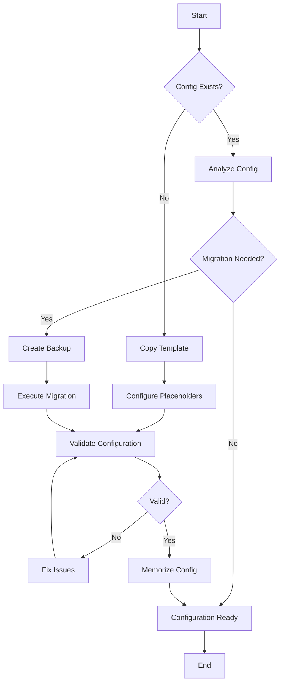

# Agent3D Configuration Template Guide

## Overview

This guide provides instructions for agents on how to use the Agent3D configuration template system to create and maintain `.agent3d-config.yml` files.

## 🎯 Quick Start for Agents

### 1. For New Projects (Foundation Pass)

```bash
# Check if template exists
ls templates.yml/agent3d-config.template.yml

# Copy template to project root
cp templates.yml/agent3d-config.template.yml .agent3d-config.yml

# Use config migrator to populate with project-specific values
python3 tools/config_migrator.py --analyze-only
python3 tools/config_migrator.py
```

### 2. For Existing Projects (Migration)

```bash
# Analyze current configuration
python3 tools/config_migrator.py --analyze-only

# Perform dry run to see what would change
python3 tools/config_migrator.py --dry-run

# Execute migration (creates backup automatically)
python3 tools/config_migrator.py

# Validate migrated configuration
python3 tools/drift_scanner.py --mode tc-mapping --quiet
```

## 📋 Template Structure

The template includes all required sections with placeholder values:

### Core Sections
- **project**: Project metadata and type
- **enabled_passes**: DDD passes to enable
- **pass_config**: Pass-specific configuration
- **quality_gates**: Quality thresholds
- **validation**: Validation settings
- **git_workflow**: Git workflow configuration
- **documentation**: Documentation standards
- **identifier_patterns**: ID pattern definitions
- **drift_detection**: Drift detection settings
- **python_paths**: Python module resolution (for Python projects)
- **mcp_server**: MCP server configuration
- **templates**: Template configuration
- **structure**: Project structure
- **metadata**: Configuration metadata

### Placeholder Format
All placeholders use the format `{PLACEHOLDER_NAME}` and include comments with:
- Available options
- Recommended values
- Examples
- Conditional requirements

## 🔧 Configuration Migration Tool

### Usage

```bash
# Basic migration
python3 tools/config_migrator.py

# Options
python3 tools/config_migrator.py --help
python3 tools/config_migrator.py --analyze-only    # Analysis only
python3 tools/config_migrator.py --dry-run         # Test migration
python3 tools/config_migrator.py --no-backup       # Skip backup
```

### What the Migrator Does

1. **Analyzes** existing configuration
2. **Identifies** missing or outdated sections
3. **Preserves** existing project-specific settings
4. **Adds** missing sections with appropriate defaults
5. **Updates** deprecated configurations
6. **Auto-detects** Python project structure
7. **Creates** backup of original file

## 🐍 Python Project Configuration

For Python projects, the migrator automatically:

### Auto-Detection
- Scans for common Python directories (`src`, `lib`, `tools`, `app`, `scripts`)
- Adds detected directories to `python_paths.source_directories`
- Configures appropriate module resolution strategies

### Python Paths Section
```yaml
python_paths:
  source_directories:
    - "tools"      # Auto-detected
    - "src"        # Auto-detected
    - "lib"        # Auto-detected
    - "."          # Fallback

  package_structure:
    flat_modules: ["tools", "scripts"]
    nested_modules: ["src", "lib", "app"]

  resolution_strategies:
    - "pyproject_toml"
    - "direct_path"
    - "flat_structure"
    - "nested_structure"
    - "package_init"

  framework_modules:
    "tools.drift_scanner": "tools/drift_scanner.py"
    "src.main": "src/main.py"
```

## 📝 Agent Instructions

### Foundation Pass Integration

```yaml
# In Foundation Pass workflow
steps:
  1. Check if .agent3d-config.yml exists
  2. If exists: Run migration analysis
  3. If migration needed: Execute migration
  4. If not exists: Copy template and configure
  5. MEMORIZE entire configuration
  6. Proceed with Foundation Pass
```

### Development Pass Integration

```yaml
# Before Code Location validation
steps:
  1. Verify python_paths section exists (Python projects)
  2. Validate module resolution configuration
  3. Run drift scanner in code-location mode
  4. Update Code Location fields as needed
```

## 🔍 Validation and Quality Checks

### Configuration Validation
```bash
# YAML syntax validation
python3 -c "import yaml; yaml.safe_load(open('.agent3d-config.yml'))"

# Drift scanner compatibility
python3 tools/drift_scanner.py --mode tc-mapping --quiet

# Configuration analysis
python3 tools/config_migrator.py --analyze-only
```

### Quality Gates
- ✅ Valid YAML syntax
- ✅ All required sections present
- ✅ Configuration version is 2.0
- ✅ Python paths configured (Python projects)
- ✅ Drift scanner loads without errors
- ✅ Agent can memorize configuration

## 🚨 Common Issues and Solutions

### Issue: YAML Parsing Errors
```bash
# Solution: Check syntax and restore backup if needed
python3 -c "import yaml; yaml.safe_load(open('.agent3d-config.yml'))"
# If fails: mv .agent3d-config.yml.backup .agent3d-config.yml
```

### Issue: Missing Python Paths
```bash
# Solution: Re-run migrator or add manually
python3 tools/config_migrator.py --analyze-only
# Check if project.language is set to "python"
```

### Issue: Drift Scanner Fails
```bash
# Solution: Validate configuration structure
python3 tools/config_migrator.py --analyze-only
# Fix any missing sections identified
```

### Issue: Agent Memory Not Updated
```bash
# Solution: Explicitly instruct agent
echo "IMMEDIATELY_MEMORIZE_ENTIRE_NEW_CONFIG"
# Agent should refresh configuration understanding
```

## 📚 Template Placeholders Reference

### Project Configuration
- `{PROJECT_NAME}`: Name of the project
- `{PROJECT_TYPE}`: web_application, api_service, library, cli_tool, etc.
- `{PRIMARY_LANGUAGE}`: python, javascript, java, go, etc.
- `{QUALITY_LEVEL}`: strict, balanced, relaxed, comprehensive

### Development Configuration
- `{DEVELOPMENT_TYPE}`: code_development, documentation_development, mixed
- `{SELECTION_MODE}`: auto, manual, picker
- `{MAX_FEATURES}`: 1-5 (recommended)

### Boolean Values
- `{COMMIT_CONFIRMATION}`: true (safe), false (automated)
- `{EXPERT_COORDINATION}`: true (comprehensive), false (basic)
- `{MCP_ENABLED}`: true (recommended), false

### Paths and Directories
- `{SOURCE_DIR_1}`: Primary source directory (e.g., "src", "tools")
- `{DOCS_DIRECTORY}`: Documentation directory (e.g., "docs/")
- `{DDD_ROOT_PATH}`: DDD project root path

## 🔄 Migration Workflow



## 🎯 Best Practices for Agents

1. **Always analyze before migrating**: Use `--analyze-only` first
2. **Use dry-run for safety**: Test migration with `--dry-run`
3. **Preserve user settings**: Migration preserves existing values
4. **Memorize after changes**: Always memorize configuration after updates
5. **Validate after migration**: Run drift scanner to ensure compatibility
6. **Auto-detect project structure**: Let migrator detect Python directories
7. **Use template for new projects**: Start with template for consistency

## 📞 Support

If migration fails or configuration issues persist:

1. Check migration log for specific errors
2. Restore backup: `mv .agent3d-config.yml.backup .agent3d-config.yml`
3. Run analysis: `python3 tools/config_migrator.py --analyze-only`
4. Fix identified issues manually
5. Re-run migration: `python3 tools/config_migrator.py`
