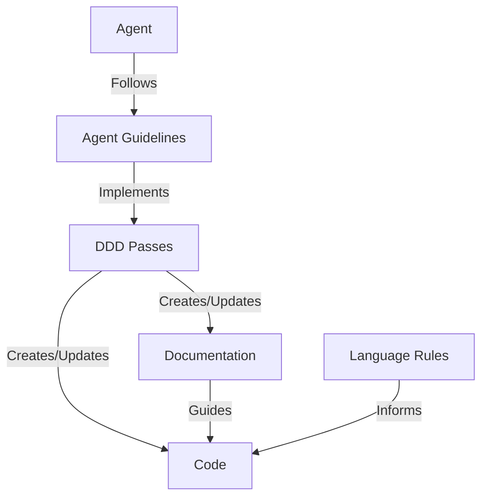
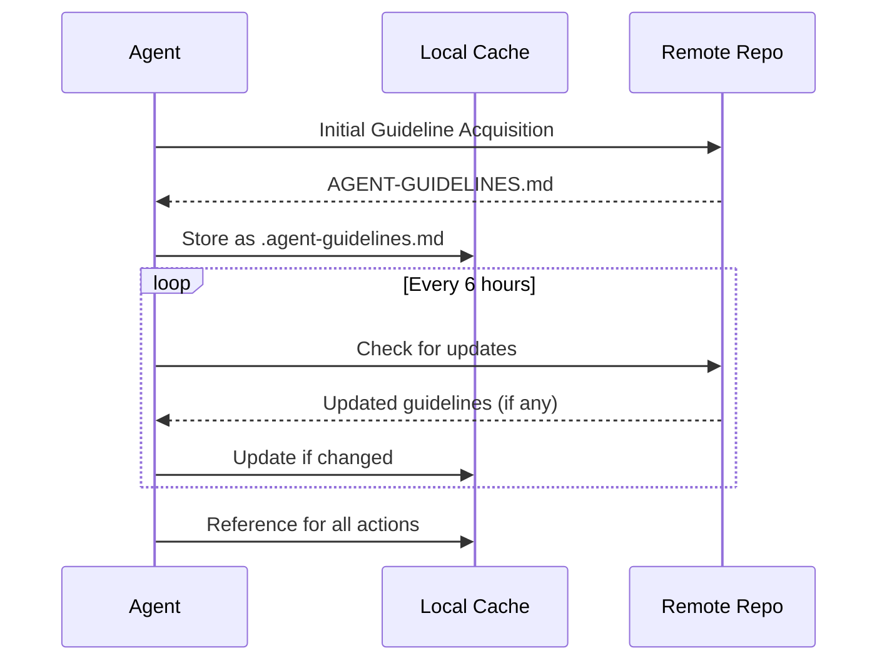
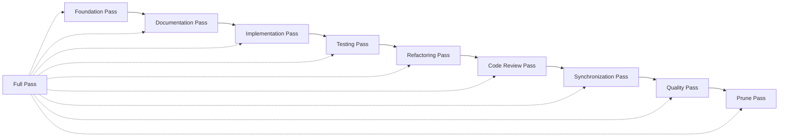
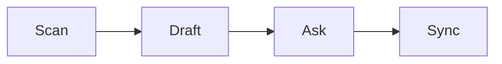
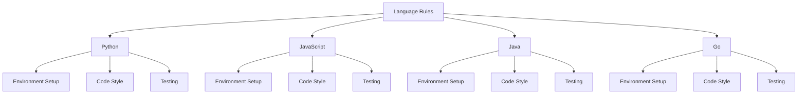
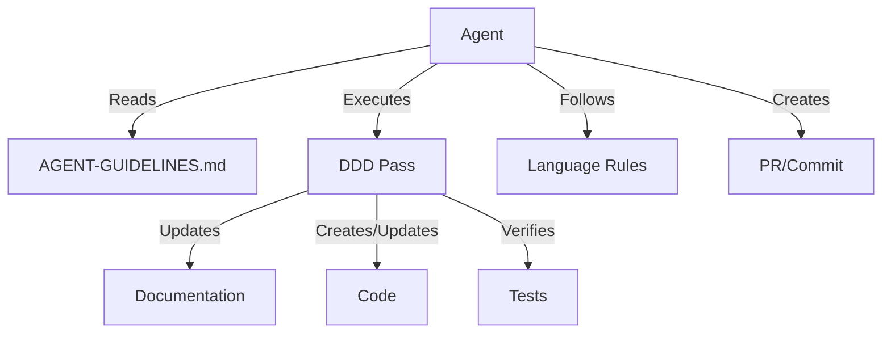

# Architecture

This document outlines the architecture of the Agent3D documentation framework.

## System Overview

Agent3D is a **documentation-only** framework that defines documentation-driven development principles for LLM coding agents. The framework consists of documentation components that work together to provide a comprehensive guideline system that ensures documentation remains the single source of truth throughout the development process.



## Core Components

### Agent Guideline Protocol

The Agent Guideline Protocol is the mechanism by which LLM agents retrieve, cache, and follow the DDD guidelines.



### DDD Pass System

The DDD Pass System provides a structured approach to documentation-driven development through a series of passes.



Each pass follows the Scan → Draft → Ask → Sync workflow:



### Language-Specific Rules

Language-specific rules provide tailored guidelines for different programming languages:



## Data Flow

The following diagram illustrates the data flow in the Agent3D framework:



## Directory Structure

```
agent3d/
├── AGENT-GUIDELINES.md    # Main guidelines document
├── README.md              # Project overview
├── LICENSE                # MIT License
├── CONTRIBUTING.md        # Contribution guidelines
├── docs/                  # Documentation directory
│   ├── FEATURES.md        # Feature specifications
│   ├── ARCHITECTURE.md    # This document
│   ├── TASKS.md           # Project backlog
│   ├── TEST-CASES.md      # Test case specifications
│   └── DEPLOYMENT.md      # Deployment instructions
├── passes/                # DDD passes documentation
│   └── simplified/        # Simplified pass definitions
│       ├── full_pass.md   # Full pass documentation
│       ├── 1_foundation_pass.md
│       ├── 2_documentation_pass.md
│       └── ...            # Other numbered passes
└── rules/                 # Language-specific rules documentation
    ├── python.md          # Python rules
    ├── javascript.md      # JavaScript rules
    ├── java.md            # Java rules
    └── go.md              # Go rules
```

**Note:** This repository contains only documentation files. There are no implementation files, libraries, or executable code. All examples are provided as documentation examples only and are not meant to be functional.
