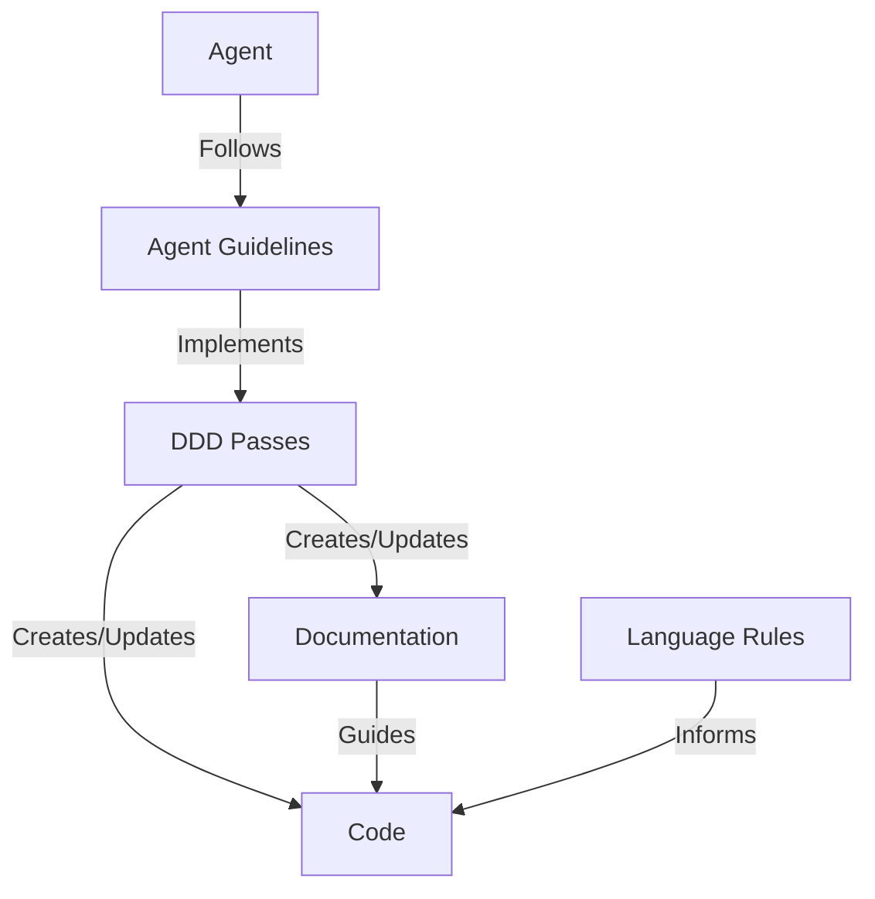
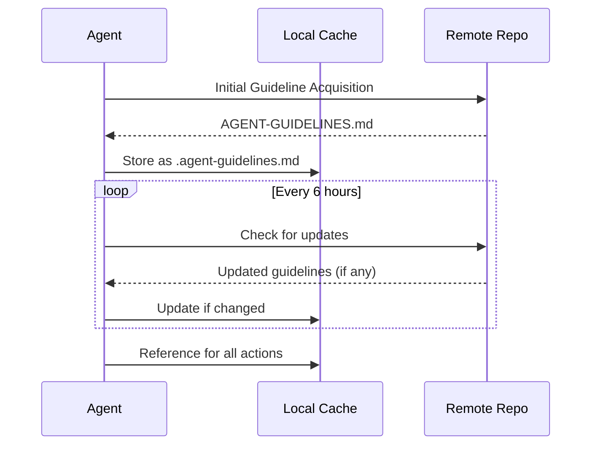
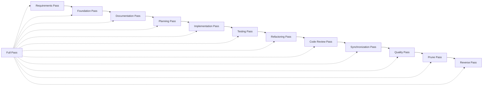
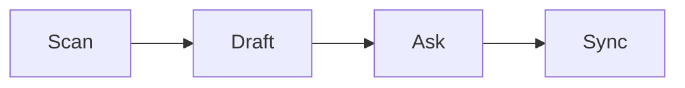
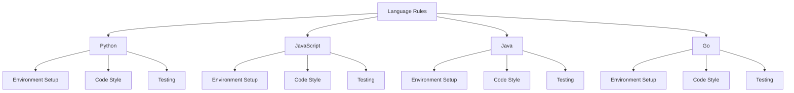
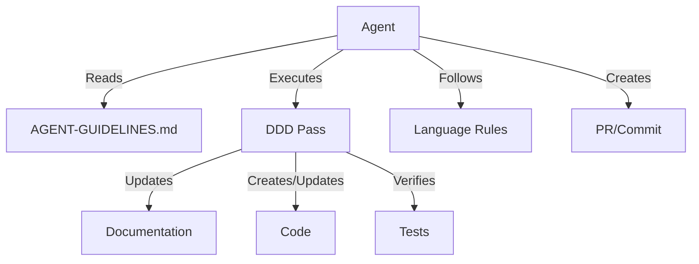
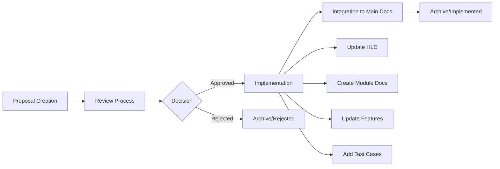

# High-Level Design

This document outlines the high-level architecture of the Agent3D documentation framework.

## System Overview

Agent3D is a **documentation-only** framework that defines documentation-driven development principles for LLM coding agents. The framework consists of documentation components that work together to provide a comprehensive guideline system that ensures documentation remains the single source of truth throughout the development process.



## Core Components

### Agent Guideline Protocol

The Agent Guideline Protocol is the mechanism by which LLM agents retrieve, cache, and follow the DDD guidelines.



### DDD Pass System

The DDD Pass System provides a structured approach to documentation-driven development through a series of passes.



Each pass follows the Scan → Draft → Ask → Sync workflow:



### Language-Specific Rules

Language-specific rules provide tailored guidelines for different programming languages:



## Data Flow

The following diagram illustrates the data flow in the Agent3D framework:



## Directory Structure

```
agent3d/
├── AGENT-GUIDELINES.md    # Main guidelines document
├── README.md              # Project overview
├── LICENSE                # MIT License
├── CONTRIBUTING.md        # Contribution guidelines
├── docs/                  # Documentation directory
│   ├── FEATURES.md        # Feature specifications
│   ├── HIGH-LEVEL-DESIGN.md # This document - system architecture
│   ├── TASKS.md           # Project backlog
│   ├── TEST-CASES.md      # Test case specifications
│   ├── DDD-STATUS.md      # DDD pass status tracking
│   ├── DEPLOYMENT.md      # Deployment instructions
│   ├── designs/           # Component designs and specifications
│   │   ├── AGENT-PROTOCOL.md    # Agent Guideline Protocol design
│   │   ├── DDD-PASSES.md        # DDD Pass System design
│   │   └── LANGUAGE-RULES.md    # Language Rules System design
│   ├── plans/             # Implementation plans for major changes
│   │   ├── completed/     # Archived completed implementation plans
│   │   └── IMPLEMENTATION-PLAN-{feature}.md # Active implementation plans
│   └── proposals/         # Design proposals for unimplemented features
│       ├── PROPOSALS-README.md  # Proposal process documentation
│       ├── active/              # Proposals under consideration
│       └── archive/             # Implemented or rejected proposals
│           ├── implemented/     # Successfully implemented proposals
│           └── rejected/        # Rejected proposals with rationale
├── passes/                # DDD passes documentation
│   └── simplified/        # Simplified pass definitions
│       ├── full_pass.md   # Full pass documentation
│       ├── 1_foundation_pass.md
│       ├── 2_documentation_pass.md
│       ├── 3_planning_pass.md  # Planning pass for major changes
│       ├── ...            # Passes 4-10
│       └── 11_reverse_pass.md  # Reverse pass for drift detection
├── rules/                 # Language-specific rules documentation
│   ├── python.md          # Python rules
│   ├── javascript.md      # JavaScript rules
│   ├── java.md            # Java rules
│   └── go.md              # Go rules
└── templates/             # Documentation templates
    ├── HIGH-LEVEL-DESIGN.template.md
    ├── FEATURES.template.md
    └── ...                # Other templates
```

## Component Designs

**Detailed Specifications:**
- **[Agent Protocol](designs/AGENT-PROTOCOL.md)** - Guideline acquisition and caching
- **[DDD Passes](designs/DDD-PASSES.md)** - Pass workflows and dependencies
- **[Language Rules](designs/LANGUAGE-RULES.md)** - Language-specific development rules

**Related Documentation:**
- **[DDD Status](DDD-STATUS.md)** - Current pass status and project health
- **[Features](FEATURES.md)** - Feature documentation and acceptance criteria
- **[Tasks](TASKS.md)** - Work backlog and priorities

## Proposal-to-Implementation Workflow

Agent3D includes a structured proposal system for managing unimplemented features and modules:



### Proposal Lifecycle
1. **Draft**: Create proposal using [PROPOSAL Template](../templates/PROPOSAL.template.md) in `docs/proposals/active/` with {PROPOSAL-NAME}.md naming
2. **Review**: Stakeholder evaluation and feedback collection
3. **Decision**: Approval or rejection with documented rationale
4. **Implementation**: Development work based on approved proposal
5. **Integration**: Move content from proposal to main DDD documentation structure
6. **Archive**: Preserve proposal history in `docs/proposals/archive/`

### Integration Process
When proposals are implemented, their content flows into the main documentation:
- **Architecture changes** → Update this HIGH-LEVEL-DESIGN.md
- **Component specifications** → Create component designs in `docs/designs/`
- **Feature definitions** → Update `docs/FEATURES.md`
- **Implementation tasks** → Add to `docs/TASKS.md`
- **Test specifications** → Define in `docs/TEST-CASES.md`

### Proposal-to-Design Flow
As proposals get implemented, they become integrated into the component designs:
- **Approved proposals** → Detailed specifications move to `docs/designs/{COMPONENT}.md`
- **Design evolution** → Existing designs are updated with new capabilities
- **Historical tracking** → Original proposals are archived for reference

**Note:** This repository contains only documentation files. There are no implementation files, libraries, or executable code. All examples are provided as documentation examples only and are not meant to be functional.
