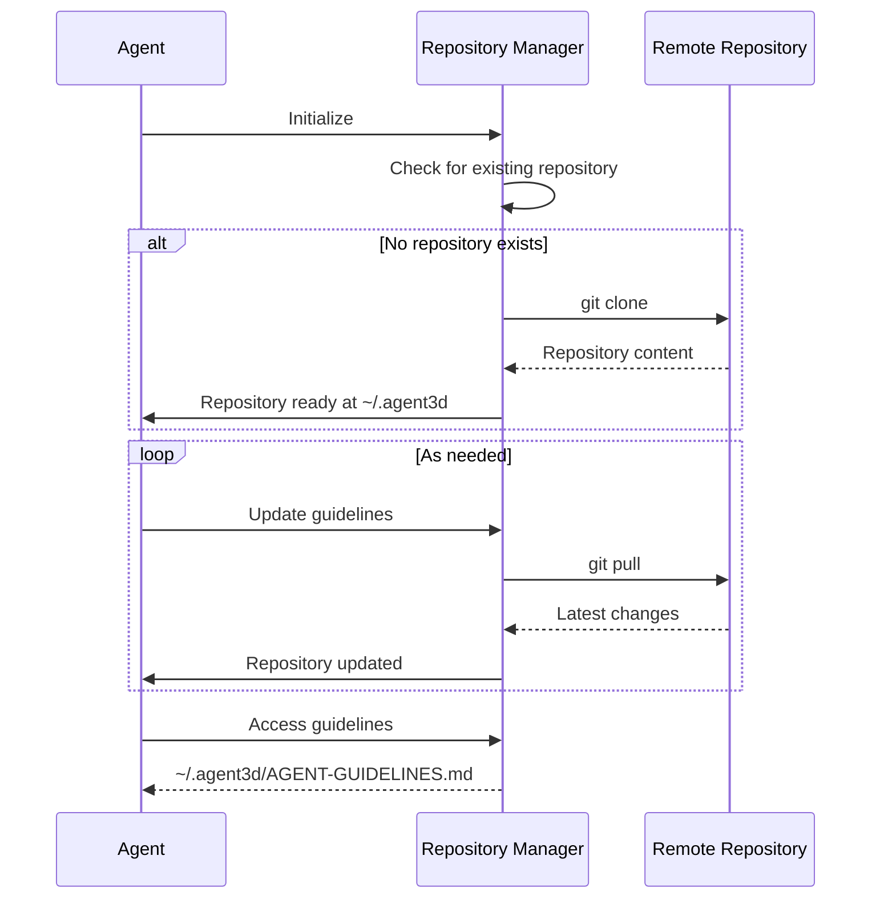

# Agent Guideline Protocol - Detailed Design

## Overview

Detailed design specifications for Agent Guideline Protocol enabling LLM agents to acquire and synchronize DDD guidelines from remote repositories.

## Component Architecture

### Core Components

#### 1. Repository Manager

- **Purpose**: Manages local `~/.agent3d` repository clone
- **Interface**: Git operations (clone, pull, status)
- **Error Handling**: Network timeouts, authentication, merge conflicts

#### 2. Synchronization Scheduler

- **Purpose**: Manages periodic updates via git pull
- **Implementation**: Background process with configurable intervals
- **Logging**: Update success/failure tracking

## Data Flow Specification



## API Specifications

### Repository Manager API

```
class RepositoryManager:
    def clone_repository(url: str, path: str) -> Result[None, Error]
    def update_repository(path: str) -> Result[None, Error]
    def check_repository_exists(path: str) -> bool
    def get_guidelines_path(path: str) -> str
    def handle_git_error(error: GitError) -> RetryStrategy
```

## Error Handling

### Git Operation Errors

- **Clone Failure**: Retry with exponential backoff (max 3 attempts)
- **Authentication Error**: Log error, prompt for credentials
- **Network Timeout**: Retry with different timeout values
- **Merge Conflicts**: Log error, continue with existing repository

### File System Errors

- **Permission Denied**: Log error, attempt alternative location
- **Disk Full**: Log critical error, maintain existing repository
- **Repository Corruption**: Re-clone repository if possible

## Configuration

### Default Settings

- **Update Interval**: As needed or regular intervals
- **Repository Location**: `~/.agent3d`
- **Entry Point**: `~/.agent3d/AGENT-GUIDELINES.md`

### Environment Variables

- `DDD_UPDATE_INTERVAL`: Override default update interval (optional)

## Security Considerations

### Content Validation

- Verify content is valid markdown
- Check for required sections (DDD Passes, Language Rules)
- Validate URL patterns in content

### Network Security

- Use HTTPS for all remote requests
- Validate SSL certificates
- Implement request signing if required

## Performance Requirements

### Response Times

- File read: < 10ms
- Git pull: < 30 seconds
- Git clone: < 60 seconds

### Resource Usage

- Memory: < 50MB for git operations
- Disk: < 10MB for repository storage
- Network: Minimal bandwidth for incremental updates

## Testing Strategy

### Unit Tests

- Repository manager with mocked git operations
- File system operations with temporary directories
- Synchronization scheduler with time mocking

### Integration Tests

- End-to-end repository cloning and updates
- Git authentication scenarios
- File system permission issues

### Performance Tests

- Large repository handling
- Concurrent git operations
- Network interruption recovery

## Monitoring and Logging

### Log Levels

- **INFO**: Successful git operations, initialization
- **WARN**: Network timeouts, retry attempts
- **ERROR**: Repository corruption, permission issues
- **DEBUG**: Detailed git operation traces

### Metrics

- Git operation success rate
- Average pull/clone time
- Repository health status
- Error frequency by type

## Future Enhancements

### Planned Features

- Multiple remote repository support
- Branch-specific guideline versions
- Webhook-based automatic updates
- Repository mirroring for reliability

### Scalability Considerations

- Shared repository cache for multi-agent environments
- Load balancing for git operations
- Content delivery network for repository hosting
