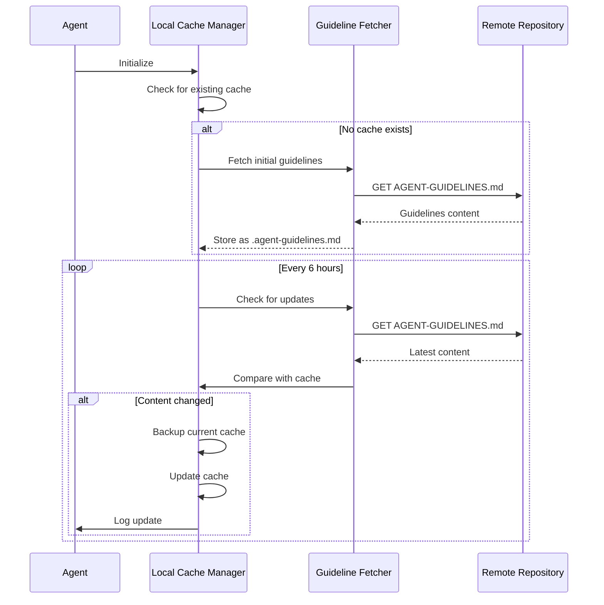

# Agent Guideline Protocol - Detailed Design

## Overview

This document provides the detailed design specifications for the Agent Guideline Protocol, which enables LLM agents to acquire, cache, and synchronize DDD guidelines from remote repositories.

## Component Architecture

### Core Components

#### 1. Guideline Fetcher
- **Purpose**: Retrieves guidelines from remote repository
- **Interface**: HTTP client with retry logic
- **Error Handling**: Network timeouts, 404 errors, rate limiting

#### 2. Local Cache Manager
- **Purpose**: Manages local `.agent-guidelines.md` file
- **Operations**: Read, write, compare, backup
- **Storage**: File system with atomic writes

#### 3. Synchronization Scheduler
- **Purpose**: Manages periodic updates (6-hour intervals)
- **Implementation**: Background process with configurable intervals
- **Logging**: Update success/failure tracking

## Data Flow Specification



## API Specifications

### Guideline Fetcher API

```
class GuidelineFetcher:
    def fetch_guidelines(url: str) -> Result[str, Error]
    def validate_content(content: str) -> bool
    def handle_network_error(error: NetworkError) -> RetryStrategy
```

### Local Cache Manager API

```
class LocalCacheManager:
    def read_cache() -> Optional[str]
    def write_cache(content: str) -> Result[None, Error]
    def compare_content(new: str, existing: str) -> bool
    def backup_cache() -> Result[None, Error]
```

## Error Handling

### Network Errors
- **Connection Timeout**: Retry with exponential backoff (max 3 attempts)
- **404 Not Found**: Log error, continue with existing cache
- **Rate Limiting**: Respect retry-after headers

### File System Errors
- **Permission Denied**: Log error, attempt alternative location
- **Disk Full**: Log critical error, maintain existing cache
- **Corruption**: Restore from backup if available

## Configuration

### Default Settings
- **Update Interval**: 6 hours
- **Retry Attempts**: 3
- **Timeout**: 30 seconds
- **Cache Location**: `./.agent-guidelines.md`

### Environment Variables
- `DDD_REMOTE_BASE`: Base URL for remote guidelines
- `DDD_UPDATE_INTERVAL`: Override default update interval
- `DDD_CACHE_PATH`: Override default cache location

## Security Considerations

### Content Validation
- Verify content is valid markdown
- Check for required sections (DDD Passes, Language Rules)
- Validate URL patterns in content

### Network Security
- Use HTTPS for all remote requests
- Validate SSL certificates
- Implement request signing if required

## Performance Requirements

### Response Times
- Cache read: < 10ms
- Remote fetch: < 5 seconds
- Cache write: < 100ms

### Resource Usage
- Memory: < 10MB for cache operations
- Disk: < 1MB for cache storage
- Network: Minimal bandwidth usage

## Testing Strategy

### Unit Tests
- Guideline fetcher with mocked HTTP responses
- Cache manager with temporary file system
- Synchronization scheduler with time mocking

### Integration Tests
- End-to-end protocol execution
- Network failure scenarios
- File system permission issues

### Performance Tests
- Large guideline document handling
- Concurrent access scenarios
- Long-running synchronization cycles

## Monitoring and Logging

### Log Levels
- **INFO**: Successful updates, initialization
- **WARN**: Network timeouts, retry attempts
- **ERROR**: Cache corruption, permission issues
- **DEBUG**: Detailed operation traces

### Metrics
- Update success rate
- Average fetch time
- Cache hit ratio
- Error frequency by type

## Future Enhancements

### Planned Features
- Differential updates (only changed sections)
- Multiple remote source support
- Encrypted cache storage
- Webhook-based updates

### Scalability Considerations
- Distributed cache for multi-agent environments
- Load balancing for high-frequency updates
- Content delivery network integration
