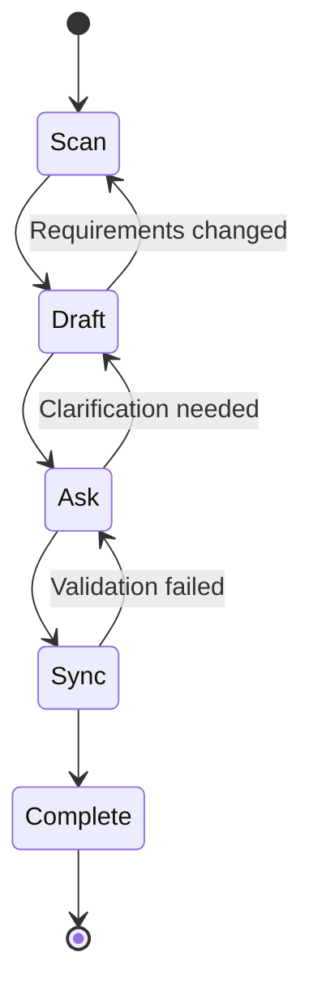
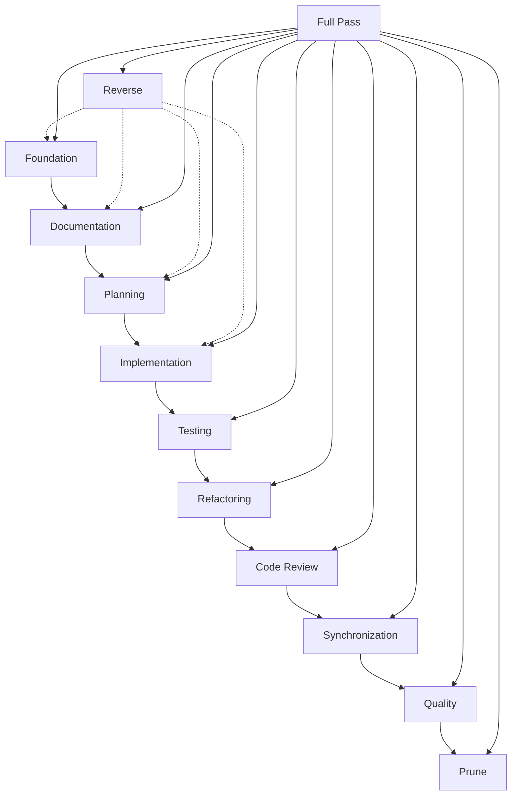

# DDD Pass System - Detailed Design

## Overview

This document provides the detailed design specifications for the DDD Pass System, which implements the structured Documentation-Driven Development workflow through a series of coordinated passes.

## System Architecture

### Pass Execution Engine

#### Core Components

1. **Pass Registry**
   - Maintains catalog of available passes
   - Handles pass dependencies and ordering
   - Validates pass configurations

2. **Workflow Orchestrator**
   - Executes Scan → Draft → Ask → Sync workflow
   - Manages pass state transitions
   - Handles error recovery and rollback

3. **Status Tracker**
   - Monitors pass execution progress
   - Calculates drift and alignment metrics
   - Updates DDD-STATUS.md

## Pass Workflow Specification

### Standard Workflow Pattern



### Workflow State Management

```
interface PassState {
    id: string
    status: 'pending' | 'scanning' | 'drafting' | 'asking' | 'syncing' | 'complete' | 'failed'
    progress: number  // 0-100
    artifacts: string[]
    errors: Error[]
    startTime: timestamp
    lastUpdate: timestamp
}
```

## Individual Pass Specifications

### 1. Foundation Pass
- **Input**: Project requirements, existing documentation
- **Output**: Core documentation files (README, FEATURES, TASKS, TEST-CASES, DDD-STATUS)
- **Dependencies**: None
- **Validation**: Template compliance, content completeness

### 2. Documentation Pass
- **Input**: Foundation documents, feature requirements
- **Output**: Detailed specifications, resolved ambiguities
- **Dependencies**: Foundation Pass
- **Validation**: Acceptance criteria completeness, test case coverage

### 3. Planning Pass
- **Input**: Complete documentation, change requirements
- **Output**: Step-by-step implementation plan with checkpoints
- **Dependencies**: Documentation Pass
- **Validation**: Plan completeness, checkpoint strategy, rollback procedures

### 4. Implementation Pass
- **Input**: Implementation plan, complete documentation, test cases
- **Output**: Working code, basic tests
- **Dependencies**: Planning Pass (for major changes), Documentation Pass
- **Validation**: Feature implementation, test execution, plan adherence

### 5. Testing Pass
- **Input**: Implemented features, test specifications
- **Output**: Comprehensive test suite, edge case coverage
- **Dependencies**: Implementation Pass
- **Validation**: Test coverage metrics, all tests passing

### 6. Refactoring Pass
- **Input**: Working implementation, code quality metrics
- **Output**: Optimized code, improved maintainability
- **Dependencies**: Testing Pass
- **Validation**: No feature regression, quality improvements

### 7. Code Review Pass
- **Input**: Complete implementation, PR context
- **Output**: Review comments, approval status
- **Dependencies**: Refactoring Pass
- **Validation**: Review completion, issue resolution

### 8. Synchronization Pass
- **Input**: All project artifacts
- **Output**: Aligned documentation and code
- **Dependencies**: Code Review Pass
- **Validation**: Consistency checks, drift elimination

### 9. Quality Pass
- **Input**: Synchronized project state
- **Output**: Quality validation report
- **Dependencies**: Synchronization Pass
- **Validation**: Quality gates, compliance checks

### 10. Prune Pass
- **Input**: Complete project state
- **Output**: Cleaned artifacts, removed redundancy
- **Dependencies**: Quality Pass
- **Validation**: No functional impact, improved clarity

### 11. Reverse Pass
- **Input**: Implementation state, documentation state
- **Output**: Updated documentation for undocumented features
- **Dependencies**: Can run independently
- **Validation**: Documentation completeness, feature coverage

## Pass Dependencies and Execution Order



## Metrics and Monitoring

### Drift Calculation

```
drift = (undocumented_features + outdated_docs + missing_tests) / total_project_elements
```

### Alignment Calculation

```
alignment = (completed_tasks + passing_tests + documented_features) / total_expected_elements
```

### Pass-Specific Metrics

#### Foundation Pass
- Documentation completeness: % of required files created
- Template compliance: % of templates properly followed
- Structural integrity: Presence of required sections

#### Implementation Pass
- Feature completion: % of documented features implemented
- Test coverage: % of features with basic tests
- Code quality: Static analysis scores

#### Testing Pass
- Test coverage: % of code covered by tests
- Test quality: % of edge cases covered
- Test reliability: % of tests passing consistently

## Error Handling and Recovery

### Error Categories

1. **Validation Errors**
   - Template non-compliance
   - Missing required content
   - Format violations

2. **Dependency Errors**
   - Missing prerequisite artifacts
   - Circular dependencies
   - Version conflicts

3. **Execution Errors**
   - Tool failures
   - Network issues
   - Permission problems

### Recovery Strategies

1. **Automatic Retry**
   - Transient failures (network, temporary locks)
   - Configurable retry count and backoff

2. **Rollback**
   - Restore previous known good state
   - Preserve work in progress

3. **Manual Intervention**
   - Complex validation failures
   - Ambiguous requirements
   - External dependencies

## Configuration and Customization

### Pass Configuration

**Foundation Pass**:
- **Enabled**: true
- **Templates**: README.template.md, FEATURES.template.md
- **Validation**: strict mode

**Implementation Pass**:
- **Enabled**: true
- **Test Coverage Threshold**: 80%
- **Quality Gates**: lint_score 8.0, complexity low

### Project-Specific Overrides

**Available Overrides**:
- **Skip Passes**: List of passes to skip
- **Custom Templates**: Project-specific template overrides
- **Validation Rules**: Custom validation configurations
- **Metrics Thresholds**: Adjusted threshold values

## Integration Points

### External Tools
- **Version Control**: Git integration for commits and PRs
- **CI/CD**: Pipeline integration for automated validation
- **Code Quality**: Integration with linters, formatters, analyzers
- **Testing**: Integration with test frameworks and coverage tools

### Template System
- Dynamic template loading from remote sources
- Template validation and preprocessing
- Variable substitution and customization

### Status Reporting
- Real-time progress updates
- Historical trend analysis
- Dashboard integration
- Notification systems

## Performance Considerations

### Execution Time Optimization
- Parallel execution where dependencies allow
- Incremental processing for large projects
- Caching of intermediate results

### Resource Management
- Memory usage monitoring
- Disk space management
- Network bandwidth optimization

### Scalability
- Multi-project support
- Distributed execution
- Load balancing across agents
