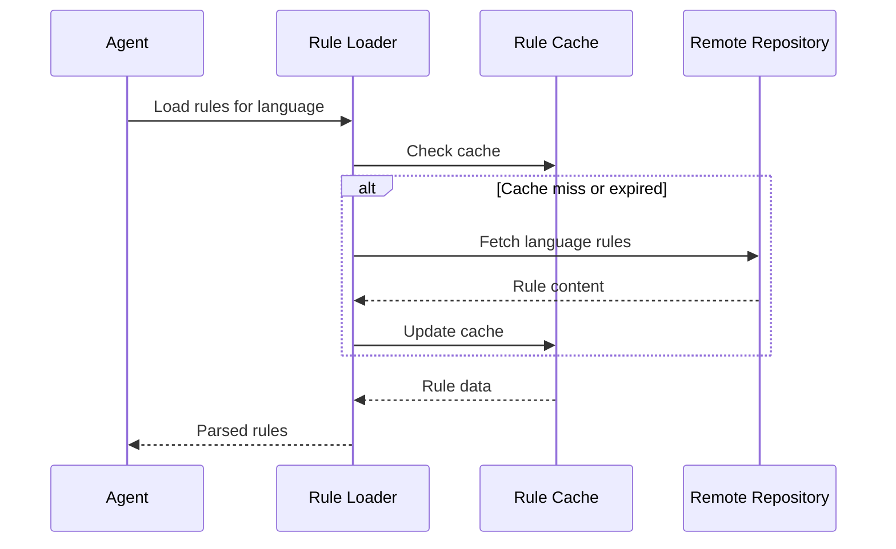

# Language Rules System - Detailed Design

## Overview

This document provides the detailed design specifications for the Language Rules System, which manages language-specific development guidelines and ensures consistent application across different programming environments.

## System Architecture

### Core Components

#### 1. Rule Registry

- **Purpose**: Maintains catalog of language-specific rules
- **Storage**: Remote rule files with local caching
- **Languages**: Python, JavaScript, Java, Go (extensible)

#### 2. Rule Loader

- **Purpose**: Fetches and caches language rules
- **Interface**: HTTP client with caching layer
- **Validation**: Rule format and content validation

#### 3. Rule Applicator

- **Purpose**: Applies rules during development workflow
- **Integration**: DDD pass system integration
- **Enforcement**: Validation and compliance checking

## Language Rule Structure

### Standard Rule Format

**Language**: Python
**Version**: 1.0

**Environment Setup**:

- Source virtualenv at project root
- Install dependencies from requirements.txt

**Environment Validation**:

- Check Python version >= 3.8
- Verify virtual environment activation

**Code Style**:

- **Formatter**: black
- **Linter**: flake8
- **Import Style**: absolute imports preferred
- **Naming Conventions**:
  - snake_case for functions and variables
  - PascalCase for classes
  - UPPER_CASE for constants

**Testing**:

- **Framework**: pytest
- **Structure**: tests/ directory parallel to src/
- **Coverage Threshold**: 80%
- **Test Naming**: test_*.py files, test_* functions

**Dependencies**:

- **Management**: pip with requirements.txt
- **Virtual Environment**: Required for all projects
- **Lock File**: requirements-lock.txt for reproducible builds

### Rule Categories

#### Environment Setup Rules

- Virtual environment configuration
- Dependency management
- Tool installation and configuration
- Path and environment variable setup

#### Code Style Rules

- Formatting standards
- Naming conventions
- Import organization
- Documentation requirements

#### Testing Rules

- Test framework selection
- Test organization patterns
- Coverage requirements
- Test naming conventions

#### Build and Deployment Rules

- Build tool configuration
- Package structure
- Deployment procedures
- CI/CD integration

## Language-Specific Implementations

### Python Rules

#### Environment Setup

```python
# Virtual environment activation
source venv/bin/activate  # Unix
venv\Scripts\activate     # Windows

# Dependency installation
pip install -r requirements.txt
pip install -r requirements-dev.txt  # Development dependencies
```

#### Code Quality

```python
# Formatting
black src/ tests/

# Linting
flake8 src/ tests/
pylint src/

# Type checking
mypy src/
```

#### Testing

Standard pytest framework with coverage reporting.

### JavaScript Rules

Modern ES6+ patterns with ESLint and Prettier formatting.

### Java Rules

Spring patterns with JUnit testing and Gradle/Maven build tools.

### Go Rules

Standard library preferred with gofmt formatting and table tests.

## Rule Application Workflow

### Rule Loading Process



### Rule Application During Passes

#### Foundation Pass

- Apply environment setup rules
- Configure project structure according to language conventions
- Set up build and dependency management

#### Implementation Pass

- Enforce code style rules
- Apply naming conventions
- Validate import patterns

#### Testing Pass

- Apply testing framework rules
- Enforce test structure conventions
- Validate coverage requirements

#### Quality Pass

- Run language-specific quality tools
- Validate compliance with all rules
- Generate quality reports

## Rule Validation and Compliance

### Validation Levels

#### Syntax Validation

- Rule file format validation
- Required field presence
- Data type validation

#### Semantic Validation

- Rule consistency checking
- Dependency validation
- Tool availability verification

#### Compliance Checking

- Code adherence to style rules
- Test coverage compliance
- Documentation requirements

### Compliance Reporting

**Compliance Report Format**:

- Language, timestamp, overall score
- Category scores (Environment, Code Style, Testing, Documentation)
- Violations with rule, severity, message, and file location

## Extensibility and Customization

### Adding New Languages

1. **Create Rule File**
   - Follow standard rule format
   - Define language-specific sections
   - Include validation rules

2. **Register Language**
   - Add to language registry
   - Configure rule loader
   - Update documentation

3. **Test Integration**
   - Validate rule loading
   - Test compliance checking
   - Verify pass integration

### Custom Rule Overrides

```yaml
project_overrides:
  python:
    testing:
      coverage_threshold: 90  # Override default 80%
    code_style:
      line_length: 120        # Override default 88
```

## Performance Considerations

**Rule Access Optimization:**

- Local file access from `.agent3d/rules.yml/ (LLM) | rules/ (human)` for fast retrieval
- Language rules loaded once per project session
- Incremental validation for changed files only

## Integration with DDD Passes

### Pass-Specific Rule Application

#### Pass Integration

**Foundation Pass:** Apply environment setup, project structure, and build tool rules
**Development Pass:** Validate code style, naming conventions, and import patterns during implementation
**Testing Pass:** Enforce testing framework and coverage requirements
**Quality Pass:** Run language-specific quality tools and compliance validation

### Rule Enforcement Points

- **Pre-commit Hooks**: Validate rules before commits
- **CI/CD Pipeline**: Enforce rules in automated builds
- **IDE Integration**: Real-time rule validation during development
- **Code Review**: Automated rule checking in PRs
