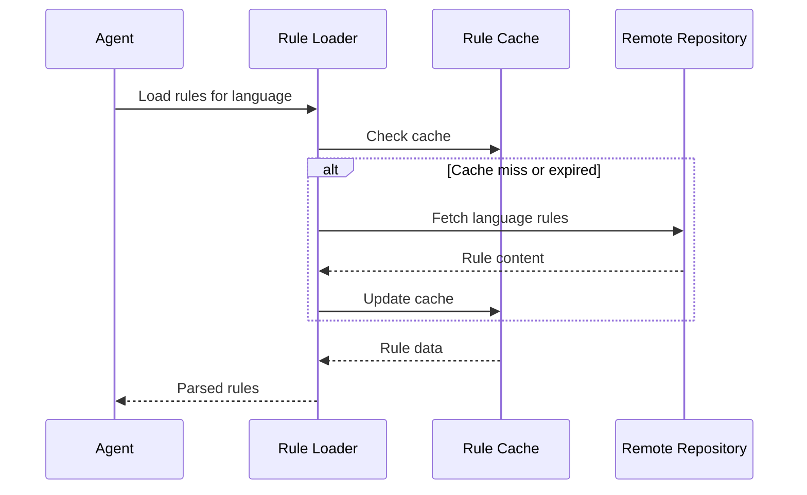

# Language Rules System - Detailed Design

## Overview

This document provides the detailed design specifications for the Language Rules System, which manages language-specific development guidelines and ensures consistent application across different programming environments.

## System Architecture

### Core Components

#### 1. Rule Registry
- **Purpose**: Maintains catalog of language-specific rules
- **Storage**: Remote rule files with local caching
- **Languages**: Python, JavaScript, Java, Go (extensible)

#### 2. Rule Loader
- **Purpose**: Fetches and caches language rules
- **Interface**: HTTP client with caching layer
- **Validation**: Rule format and content validation

#### 3. Rule Applicator
- **Purpose**: Applies rules during development workflow
- **Integration**: DDD pass system integration
- **Enforcement**: Validation and compliance checking

## Language Rule Structure

### Standard Rule Format

```yaml
language: python
version: "1.0"
environment:
  setup:
    - "Source virtualenv at project root"
    - "Install dependencies from requirements.txt"
  validation:
    - "Check Python version >= 3.8"
    - "Verify virtual environment activation"

code_style:
  formatter: "black"
  linter: "flake8"
  import_style: "absolute imports preferred"
  naming_conventions:
    - "snake_case for functions and variables"
    - "PascalCase for classes"
    - "UPPER_CASE for constants"

testing:
  framework: "pytest"
  structure: "tests/ directory parallel to src/"
  coverage_threshold: 80
  test_naming: "test_*.py files, test_* functions"

dependencies:
  management: "pip with requirements.txt"
  virtual_env: "required for all projects"
  lock_file: "requirements-lock.txt for reproducible builds"
```

### Rule Categories

#### Environment Setup Rules
- Virtual environment configuration
- Dependency management
- Tool installation and configuration
- Path and environment variable setup

#### Code Style Rules
- Formatting standards
- Naming conventions
- Import organization
- Documentation requirements

#### Testing Rules
- Test framework selection
- Test organization patterns
- Coverage requirements
- Test naming conventions

#### Build and Deployment Rules
- Build tool configuration
- Package structure
- Deployment procedures
- CI/CD integration

## Language-Specific Implementations

### Python Rules

#### Environment Setup
```python
# Virtual environment activation
source venv/bin/activate  # Unix
venv\Scripts\activate     # Windows

# Dependency installation
pip install -r requirements.txt
pip install -r requirements-dev.txt  # Development dependencies
```

#### Code Quality
```python
# Formatting
black src/ tests/

# Linting
flake8 src/ tests/
pylint src/

# Type checking
mypy src/
```

#### Testing
```python
# Test execution
pytest tests/ -v --cov=src --cov-report=html

# Test structure
tests/
├── unit/
├── integration/
└── conftest.py
```

### JavaScript Rules

#### Environment Setup
```javascript
// Package management
npm install
npm ci  // For CI environments

// Environment configuration
node --version  // >= 16.0.0
npm --version
```

#### Code Quality
```javascript
// Formatting
prettier --write src/ tests/

// Linting
eslint src/ tests/
```

#### Testing
```javascript
// Test execution
npm test
npm run test:coverage

// Test frameworks
jest  // Unit testing
cypress  // E2E testing
```

### Java Rules

#### Environment Setup
```java
// Build tool
./gradlew build  // Gradle
mvn compile      // Maven

// Java version
java -version  // >= 11
```

#### Code Quality
```java
// Formatting
./gradlew spotlessApply

// Static analysis
./gradlew checkstyleMain
./gradlew pmdMain
```

#### Testing
```java
// Test execution
./gradlew test
./gradlew jacocoTestReport  // Coverage

// Test structure
src/
├── main/java/
└── test/java/
```

### Go Rules

#### Environment Setup
```go
// Module management
go mod init
go mod tidy
go mod download

// Go version
go version  // >= 1.19
```

#### Code Quality
```go
// Formatting
go fmt ./...
goimports -w .

// Linting
golangci-lint run
```

#### Testing
```go
// Test execution
go test ./...
go test -race ./...
go test -cover ./...

// Benchmark testing
go test -bench=.
```

## Rule Application Workflow

### Rule Loading Process



### Rule Application During Passes

#### Foundation Pass
- Apply environment setup rules
- Configure project structure according to language conventions
- Set up build and dependency management

#### Implementation Pass
- Enforce code style rules
- Apply naming conventions
- Validate import patterns

#### Testing Pass
- Apply testing framework rules
- Enforce test structure conventions
- Validate coverage requirements

#### Quality Pass
- Run language-specific quality tools
- Validate compliance with all rules
- Generate quality reports

## Rule Validation and Compliance

### Validation Levels

#### Syntax Validation
- Rule file format validation
- Required field presence
- Data type validation

#### Semantic Validation
- Rule consistency checking
- Dependency validation
- Tool availability verification

#### Compliance Checking
- Code adherence to style rules
- Test coverage compliance
- Documentation requirements

### Compliance Reporting

```yaml
compliance_report:
  language: python
  timestamp: "2024-01-15T10:30:00Z"
  overall_score: 85
  categories:
    environment: 100
    code_style: 80
    testing: 75
    documentation: 90
  violations:
    - rule: "test_coverage_threshold"
      severity: "warning"
      message: "Coverage 75% below threshold 80%"
      file: "src/utils.py"
```

## Extensibility and Customization

### Adding New Languages

1. **Create Rule File**
   - Follow standard rule format
   - Define language-specific sections
   - Include validation rules

2. **Register Language**
   - Add to language registry
   - Configure rule loader
   - Update documentation

3. **Test Integration**
   - Validate rule loading
   - Test compliance checking
   - Verify pass integration

### Custom Rule Overrides

```yaml
project_overrides:
  python:
    testing:
      coverage_threshold: 90  # Override default 80%
    code_style:
      line_length: 120        # Override default 88
```

## Performance and Caching

### Rule Caching Strategy
- **Local Cache**: File-based cache with TTL
- **Memory Cache**: In-memory cache for active rules
- **Invalidation**: Time-based and content-based invalidation

### Performance Optimization
- **Lazy Loading**: Load rules only when needed
- **Parallel Validation**: Run compliance checks in parallel
- **Incremental Checking**: Check only changed files

## Integration with DDD Passes

### Pass-Specific Rule Application

#### Foundation Pass Integration
```python
def apply_foundation_rules(language: str, project_path: str):
    rules = load_language_rules(language)
    setup_environment(rules.environment)
    configure_project_structure(rules.structure)
    initialize_build_tools(rules.build)
```

#### Implementation Pass Integration
```python
def apply_implementation_rules(language: str, files: List[str]):
    rules = load_language_rules(language)
    validate_code_style(files, rules.code_style)
    check_naming_conventions(files, rules.naming)
    verify_import_patterns(files, rules.imports)
```

### Rule Enforcement Points
- **Pre-commit Hooks**: Validate rules before commits
- **CI/CD Pipeline**: Enforce rules in automated builds
- **IDE Integration**: Real-time rule validation during development
- **Code Review**: Automated rule checking in PRs

## Monitoring and Analytics

### Rule Usage Metrics
- Rule application frequency
- Compliance rates by language
- Common violation patterns
- Performance impact measurements

### Quality Trends
- Compliance improvement over time
- Rule effectiveness analysis
- Language adoption patterns
- Tool usage statistics
