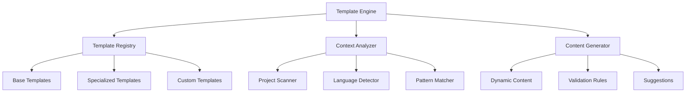

# Enhanced Template System - Proposal

**STATUS:** Under Review
**CREATED:** 2024-01-15
**LAST UPDATED:** 2024-01-17
**AUTHOR(S):** Agent3D Team
**REVIEWERS:** Agent3D Core Team

## Problem Statement

The current template system in Agent3D provides basic documentation templates but lacks advanced features for dynamic content generation, template inheritance, and context-aware suggestions.

### Current State
- Static templates with placeholder substitution
- Manual template selection and application
- Limited validation and guidance
- No template versioning or inheritance

### Pain Points
- Agents must manually choose appropriate templates
- No guidance for template customization based on project context
- Repetitive content across similar templates
- Difficult to maintain consistency across template updates

## Motivation

### Business Value
- Improved agent productivity through intelligent template selection
- Better documentation quality through enhanced validation
- Reduced maintenance overhead through template inheritance
- Faster onboarding for new project types

### Technical Benefits
- Modular template architecture
- Dynamic content generation based on project analysis
- Automated template validation and suggestions
- Version control and template evolution tracking

### User Impact
Enhanced developer experience with more intelligent and context-aware documentation generation.

## Proposed Solution

### Overview
Implement an enhanced template system that provides intelligent template selection, dynamic content generation, template inheritance, and advanced validation capabilities.

### Architecture

### Key Components

#### Template Engine
- **Purpose**: Orchestrate template selection, processing, and generation
- **Responsibilities**: Coordinate between registry, analyzer, and generator
- **Interface**: REST API and CLI for agent integration

#### Context Analyzer
- **Purpose**: Analyze project context to suggest appropriate templates
- **Responsibilities**: Scan project structure, detect patterns, identify requirements
- **Interface**: Analysis API with project metadata input/output

#### Content Generator
- **Purpose**: Generate dynamic content based on context and templates
- **Responsibilities**: Merge templates with context data, apply inheritance, validate output
- **Interface**: Generation API with template and context inputs

### Implementation Plan

### Phase 1: Core Engine (4 weeks)
- Implement basic template engine architecture
- Create template registry with inheritance support
- Develop context analyzer for project scanning
- Basic CLI interface for template operations

### Phase 2: Intelligence Layer (3 weeks)
- Add intelligent template selection based on project analysis
- Implement dynamic content generation
- Create validation framework with customizable rules
- Enhanced CLI with suggestion capabilities

### Phase 3: Integration & Polish (2 weeks)
- Integrate with existing DDD pass system
- Add comprehensive testing and documentation
- Performance optimization and error handling
- Agent integration and workflow updates

### Dependencies
- **Template Storage**: File system or database for template storage
- **Project Analysis**: Static analysis tools for project scanning
- **Validation Framework**: Schema validation and rule engine

## Success Criteria

### Functional Requirements
- Intelligent template selection based on project context
- Template inheritance and composition capabilities
- Dynamic content generation with validation
- Integration with existing DDD workflow

### Non-Functional Requirements
- **Performance**: Template generation < 2 seconds for typical projects
- **Scalability**: Support for 100+ templates with inheritance chains
- **Reliability**: 99.9% uptime for template operations
- **Security**: Secure template storage and execution environment

### Acceptance Criteria
- Agents can automatically get appropriate templates for their project type
- Template inheritance reduces duplication by 70%
- Validation catches 95% of common template errors
- Integration with DDD passes requires no workflow changes

## Integration Plan

### Existing System Integration
The enhanced template system will integrate with the current DDD pass system by providing intelligent template suggestions during Foundation and Documentation passes.

### Migration Strategy
- Gradual rollout starting with new templates
- Backward compatibility with existing static templates
- Migration tools for converting static templates to enhanced format

### Testing Strategy
- **Unit Testing**: Individual component testing with mocked dependencies
- **Integration Testing**: End-to-end template generation workflows
- **Performance Testing**: Load testing with large template sets
- **User Acceptance Testing**: Agent workflow validation

## Alternatives Considered

### Alternative 1: External Template Engine
- **Description**: Use existing template engines like Jinja2 or Handlebars
- **Pros**: Mature, well-tested, extensive feature set
- **Cons**: Additional dependency, may not fit DDD-specific needs
- **Why Not Chosen**: Lacks DDD-specific intelligence and integration

### Alternative 2: Simple Template Enhancement
- **Description**: Add basic features to existing template system
- **Pros**: Minimal changes, low risk
- **Cons**: Limited capabilities, doesn't address core issues
- **Why Not Chosen**: Doesn't provide sufficient value for the effort

## Next Steps

### Immediate Actions
- [ ] Finalize proposal review and approval process
- [ ] Create detailed technical specification
- [ ] Set up development environment and repository
- [ ] Begin Phase 1 implementation

### Review Process
- Technical review by Agent3D core team
- Architecture review for system integration
- Resource allocation and timeline validation

### Approval Requirements
- Technical feasibility confirmation
- Resource availability verification
- Integration plan approval
