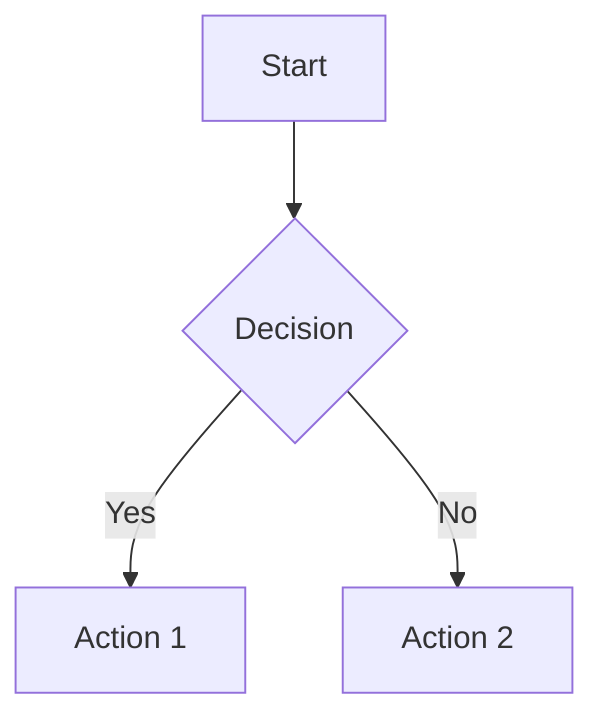
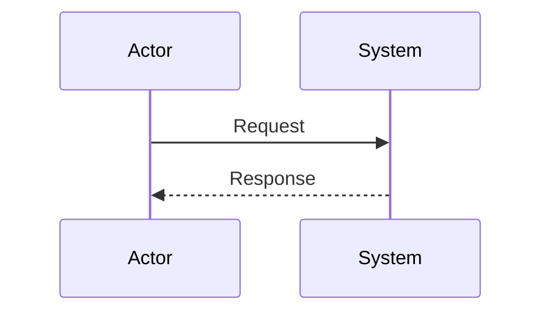
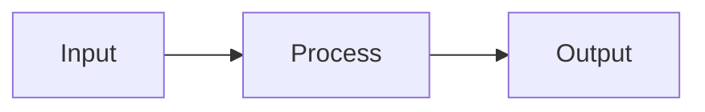

# Markdown Development Rules

**Language:** Markdown
**Purpose:** Documentation-focused development with LLM optimization
**Scope:** Documentation projects, technical writing, and LLM-consumed content

## Core Principles

### Documentation-First Development
- Markdown is the implementation, not just documentation
- Structure and clarity are paramount
- Consistency across all documentation files
- LLM-optimized content for agent consumption

### Content Philosophy
- **Assume LLM Competency:** Remove verbose explanations of standard tools and practices
- **Command-Centric:** Provide exact commands and syntax, minimal explanation
- **Project-Specific Focus:** Emphasize unique procedures and configurations
- **Brevity with Context:** Maintain necessary context without verbosity

## File Structure Standards

### Naming Conventions
- Use kebab-case for file names: `user-guide.md`, `api-reference.md`
- Use descriptive, specific names: `github-integration.md` not `integration.md`
- Prefix numbered sequences: `1_foundation_pass.md`, `2_documentation_pass.md`
- Use `.template.md` suffix for templates

### Directory Organization
```
docs/
├── README.md                    # Project overview
├── REQUIREMENTS.md              # Functional requirements
├── designs/                     # Component specifications
├── proposals/                   # Feature proposals
└── guides/                      # User guides
```

### File Headers
Every markdown file should start with:
```markdown
# Document Title

**Purpose:** Brief description of document purpose
**Audience:** Target audience (developers, LLMs, users)
**Last Updated:** YYYY-MM-DD
```

## Content Structure Rules

### Heading Hierarchy
- Use consistent heading levels: `#` → `##` → `###`
- No skipping levels: Don't go from `#` to `###`
- Use descriptive headings that work as standalone navigation
- Maximum 4 heading levels for readability

### Lists and Organization
- Use `-` for unordered lists (consistent bullet style)
- Use `1.` for ordered lists (auto-numbering)
- Nest lists with 2-space indentation
- Use task lists `- [ ]` for actionable items

### Code Blocks and Commands
- Always specify language for syntax highlighting: ````markdown` not ````
- Use `bash` for shell commands, not `sh` or `shell`
- Include exact commands without verbose explanations
- Use inline code for file names, variables, and short commands

## LLM Optimization Rules

### Content Compression
- **Remove Basic Explanations:** Assume knowledge of git, npm, standard tools
- **Focus on Specifics:** Keep project-specific details and exact commands
- **Eliminate Redundancy:** Don't repeat information available elsewhere
- **Command-First:** Lead with the command, minimal context

### Examples of Compression
**Before (Verbose):**
```markdown
To create a new branch, you need to use git checkout with the -b flag.
This will create and switch to a new branch. Run the following command
where feature-name should be descriptive of your changes:
```

**After (LLM-Optimized):**
```markdown
Create feature branch:
```bash
git checkout -b feature-name
```

### Information Hierarchy
1. **Essential Commands:** Always include exact syntax
2. **Project Context:** Keep project-specific configurations
3. **Critical Warnings:** Preserve important constraints
4. **Standard Procedures:** Compress to command-only format

## Link and Reference Standards

### Internal Links
- Use relative paths: `[Guide](../guides/setup.md)` not absolute URLs
- Link to specific sections: `[Setup Process](setup.md#installation)`
- Verify all links during documentation passes
- Use descriptive link text, not "click here"

### External Links
- Use reference-style links for repeated URLs
- Include link validation in testing
- Prefer stable, official documentation links
- Archive important external content when possible

## Template Integration

### Template Usage
- All documents should derive from appropriate templates
- Replace all `{{placeholders}}` with actual content
- Remove `<template>` and `<example>` tags before finalizing
- Follow template structure exactly for consistency

### Template Variables
Common variables across markdown documents:
- `{{project_name}}` - Project name
- `{{document_title}}` - Document title
- `{{creation_date}}` - Creation timestamp
- `{{author}}` - Document author

## Quality Standards

### Content Quality
- **Clarity:** Every sentence should have clear purpose
- **Accuracy:** All commands and procedures must be tested
- **Completeness:** Cover all necessary information without excess
- **Consistency:** Use same terminology and format throughout

### Technical Accuracy
- Test all commands and procedures
- Verify all links and references
- Ensure code examples are functional
- Validate against actual implementation

### LLM Readability
- Use clear, unambiguous language
- Structure information hierarchically
- Provide context without verbosity
- Focus on actionable information

## Documentation Types

### Process Documentation
- Focus on step-by-step procedures
- Use numbered lists for sequential steps
- Include verification steps
- Compress standard tool usage

### Reference Documentation
- Organize information for quick lookup
- Use consistent formatting for similar items
- Include examples for complex concepts
- Minimize explanatory text

### Guide Documentation
- Balance completeness with brevity
- Assume reader competency with basics
- Focus on project-specific procedures
- Include troubleshooting for common issues

## Validation Rules

### Automated Checks
- Markdown linting (markdownlint)
- Link validation
- Spell checking
- Template compliance
- Mermaid diagram syntax validation
- Code block language specification
- Heading hierarchy validation

### Manual Review
- Content accuracy verification
- LLM optimization review
- Cross-reference validation
- Consistency checking

## Markdown Rendering Validation

### Critical Rendering Issues (Must Fix)

#### Mermaid Diagram Validation
- [ ] **Syntax Correctness:** All mermaid diagrams use valid syntax
- [ ] **Proper Fencing:** Mermaid blocks use ````mermaid` with language specification
- [ ] **Node Naming:** Use consistent node naming (A, B, C... or descriptive names)
- [ ] **Arrow Syntax:** Use correct arrow syntax (`-->`, `-.->`, `==>`)
- [ ] **Diagram Types:** Verify diagram type matches content (graph, sequenceDiagram, etc.)

#### Code Block Validation
- [ ] **Language Specification:** All code blocks specify language (````bash`, ````yaml`, etc.)
- [ ] **Consistent Fencing:** Use triple backticks (````), not single or double
- [ ] **Proper Indentation:** Code blocks maintain consistent indentation
- [ ] **Syntax Highlighting:** Language tags enable proper syntax highlighting

#### Link Validation
- [ ] **Relative Path Accuracy:** Internal links use correct relative paths
- [ ] **Anchor Link Format:** Section links use proper `#heading-format`
- [ ] **External Link Validity:** All external URLs are accessible
- [ ] **Reference Link Format:** Reference-style links properly formatted

#### Table Validation
- [ ] **Pipe Alignment:** Table pipes (`|`) properly aligned
- [ ] **Header Separation:** Tables include header separator row
- [ ] **Cell Content:** No empty cells without explicit spacing
- [ ] **Consistent Columns:** All rows have same number of columns

### High Priority Rendering Issues

#### Heading Structure
- [ ] **Hierarchy Compliance:** No skipped heading levels (H1 → H2 → H3)
- [ ] **Unique Anchors:** Heading text creates unique anchor links
- [ ] **Navigation Clarity:** Headings work as standalone navigation
- [ ] **Length Limits:** Headings under 60 characters for readability

#### List Formatting
- [ ] **Consistent Bullets:** Use `-` for unordered lists throughout
- [ ] **Proper Nesting:** Nested lists use 2-space indentation
- [ ] **Task List Format:** Checkboxes use `- [ ]` and `- [x]` format
- [ ] **Mixed List Avoidance:** Don't mix ordered and unordered in same context

#### Special Characters
- [ ] **HTML Entity Usage:** Use HTML entities for special characters when needed
- [ ] **Escape Characters:** Properly escape markdown special characters
- [ ] **Unicode Handling:** Ensure unicode characters render correctly
- [ ] **Emoji Consistency:** Use consistent emoji format (unicode vs shortcodes)

### Medium Priority Rendering Issues

#### Emphasis and Formatting
- [ ] **Bold/Italic Syntax:** Use `**bold**` and `*italic*` consistently
- [ ] **Inline Code Format:** Use single backticks for inline code
- [ ] **Strikethrough Format:** Use `~~text~~` for strikethrough
- [ ] **Consistent Emphasis:** Apply emphasis consistently across documents

#### Image and Media
- [ ] **Alt Text Presence:** All images include descriptive alt text
- [ ] **Path Accuracy:** Image paths are correct and accessible
- [ ] **Size Considerations:** Images are appropriately sized for context
- [ ] **Format Support:** Use widely supported image formats (PNG, JPG, SVG)

#### Blockquotes and Callouts
- [ ] **Quote Formatting:** Use `>` for blockquotes consistently
- [ ] **Nested Quotes:** Properly format nested blockquotes
- [ ] **Callout Syntax:** Use consistent callout formatting if supported
- [ ] **Attribution Format:** Properly attribute quoted content

### Rendering Compatibility

#### GitHub Flavored Markdown
- [ ] **GFM Compliance:** Follow GitHub Flavored Markdown specifications
- [ ] **Table Support:** Use GFM table syntax
- [ ] **Task List Support:** Use GFM task list format
- [ ] **Syntax Highlighting:** Use GFM supported language identifiers

#### Cross-Platform Compatibility
- [ ] **Standard Compliance:** Follow CommonMark specification
- [ ] **Parser Compatibility:** Test with multiple markdown parsers
- [ ] **Mobile Rendering:** Ensure content renders well on mobile devices
- [ ] **Accessibility:** Follow accessibility guidelines for markdown content

### Mermaid Diagram Best Practices

#### Diagram Syntax Rules
```markdown
# Correct Mermaid Syntax Examples

## Graph Diagrams


## Sequence Diagrams


## Flowcharts

```

#### Common Mermaid Errors to Avoid
- **Missing Language Tag:** Always use ````mermaid`
- **Invalid Node Names:** Use alphanumeric characters for node IDs
- **Incorrect Arrow Syntax:** Use `-->` for solid, `-.->` for dashed arrows
- **Malformed Participant Names:** Use valid identifiers in sequence diagrams
- **Syntax Mixing:** Don't mix different diagram syntaxes in one block

## Common Anti-Patterns

### Avoid These Patterns
- **Over-explanation:** Don't explain basic development concepts
- **Redundant Information:** Don't repeat content from other documents
- **Verbose Commands:** Don't include installation instructions for standard tools
- **Inconsistent Structure:** Don't deviate from established patterns
- **Broken Links:** Don't leave unvalidated references

### Preferred Alternatives
- **Concise Commands:** Provide exact syntax with minimal context
- **Cross-References:** Link to detailed information instead of repeating
- **Assumed Knowledge:** Build on standard development knowledge
- **Consistent Patterns:** Follow established documentation structure

## Rendering Validation Checklist

### Pre-Commit Validation
Before committing any markdown changes, verify:

- [ ] **Mermaid Diagrams Render:** All diagrams display correctly in GitHub preview
- [ ] **Code Blocks Highlight:** All code blocks show proper syntax highlighting
- [ ] **Links Function:** All internal and external links work correctly
- [ ] **Tables Display:** All tables render with proper alignment
- [ ] **Headings Navigate:** All headings create proper anchor links
- [ ] **Lists Format:** All lists display with consistent formatting
- [ ] **Images Load:** All images display with proper alt text
- [ ] **Special Characters:** All special characters render correctly

### Cross-Platform Testing
Test markdown rendering across:

- [ ] **GitHub Web Interface:** Primary rendering target
- [ ] **GitHub Mobile App:** Mobile compatibility
- [ ] **VS Code Preview:** Development environment preview
- [ ] **Common Markdown Parsers:** Pandoc, CommonMark, etc.

### Accessibility Validation
Ensure markdown content is accessible:

- [ ] **Alt Text Present:** All images have descriptive alt text
- [ ] **Heading Structure:** Logical heading hierarchy for screen readers
- [ ] **Link Context:** Link text is descriptive and meaningful
- [ ] **Color Independence:** Information not conveyed by color alone
- [ ] **Keyboard Navigation:** All interactive elements are keyboard accessible

### Performance Considerations
Optimize markdown for performance:

- [ ] **Image Optimization:** Images are appropriately sized and compressed
- [ ] **Diagram Complexity:** Mermaid diagrams are not overly complex
- [ ] **File Size:** Markdown files are reasonably sized for quick loading
- [ ] **External Dependencies:** Minimize external resource dependencies

---

**Usage:** Apply these rules during Documentation Pass, Refactoring Pass, and Code Review Pass for all markdown content. Use the rendering validation checklist before committing any markdown changes to ensure proper display across all platforms.
