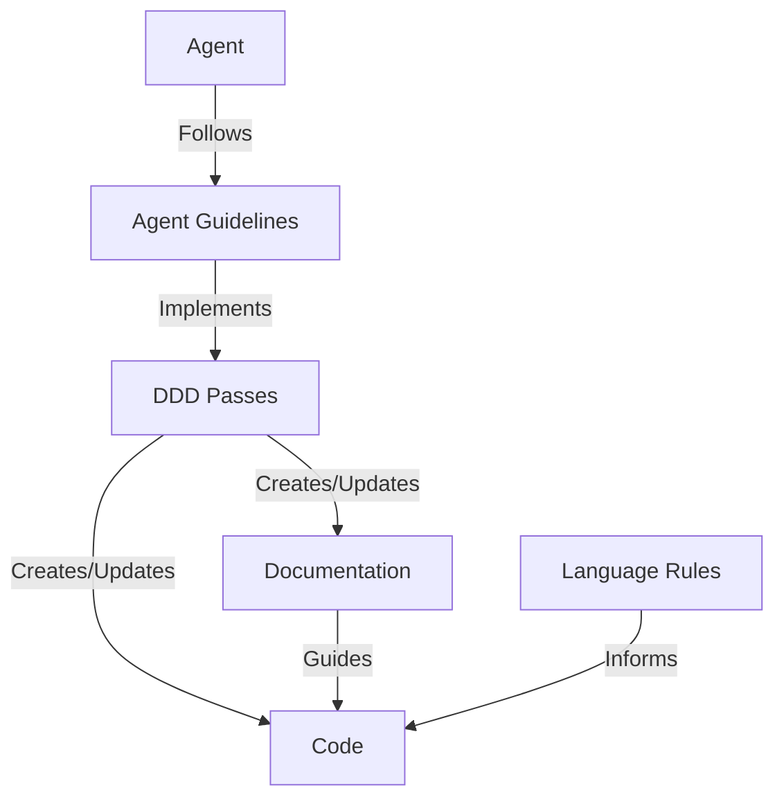
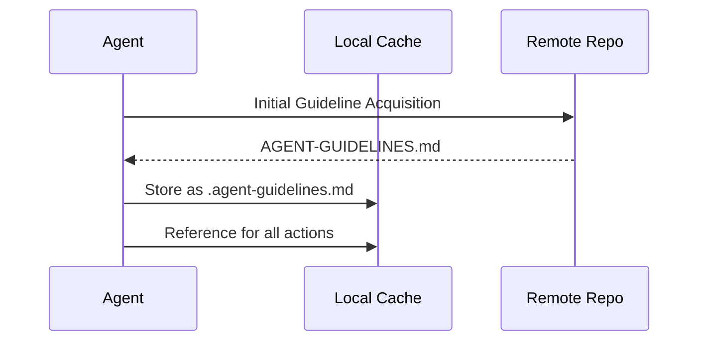

# Architecture

**FORMAT SPECIFICATION:** This document must provide a comprehensive technical overview of the system architecture. It must include:
- System overview with high-level description
- Core components and their responsibilities
- Data flow diagrams (using Mermaid syntax)
- Component interaction patterns
- Directory/file structure
- Technical decisions and rationale
- Integration points and dependencies

**REQUIRED SECTIONS:**
1. System Overview - High-level description
2. Core Components - Main system parts and responsibilities
3. Data Flow - How information moves through the system
4. Component Interactions - How parts work together
5. Directory Structure - File organization
6. Technical Decisions - Key architectural choices
7. Dependencies - External systems and libraries

**TEMPLATE:** (Do NOT include `<template>` tags in actual documentation)
<template>
# Architecture

## System Overview
{{system_description}}

```mermaid
{{high_level_diagram}}
```

## Core Components

### {{component_name}}
{{component_description}}

### {{component_name}}
{{component_description}}

## Data Flow
{{data_flow_description}}

```mermaid
{{data_flow_diagram}}
```

## Component Interactions
{{interaction_description}}

## Directory Structure
```
{{directory_structure}}
```

## Technical Decisions

### {{decision_name}}
**Rationale:** {{decision_rationale}}
**Alternatives Considered:** {{alternatives}}
**Trade-offs:** {{trade_offs}}

## Dependencies
- **{{dependency_name}}** - {{dependency_description}}
- **{{dependency_name}}** - {{dependency_description}}
</template>

**EXAMPLE:** (Do NOT include `<example>` tags in actual documentation)
<example>
# Architecture

## System Overview
Agent3D is a documentation-only framework that defines Documentation-Driven Development (DDD) principles specifically for Large Language Model (LLM) coding agents. The framework consists of documentation components that work together to provide a comprehensive guideline system.



## Core Components

### Agent Guideline Protocol
The mechanism by which LLM agents retrieve, cache, and follow the DDD guidelines from remote repositories.

### DDD Pass System
Structured approach to documentation-driven development through a series of passes (Foundation, Documentation, Implementation, etc.).

## Data Flow
Guidelines flow from remote repository to local cache, then guide agent decisions throughout the development process.



## Component Interactions
Agents follow cached guidelines to execute DDD passes, which create and update both documentation and code while maintaining alignment.

## Directory Structure
```
agent3d/
├── AGENT-GUIDELINES.md    # Main guidelines document
├── README.md              # Project overview
├── docs/                  # Documentation directory
│   ├── FEATURES.md        # Feature specifications
│   ├── ARCHITECTURE.md    # This document
│   └── TASKS.md           # Project backlog
├── passes/                # DDD passes documentation
│   └── simplified/        # Simplified pass definitions
└── rules/                 # Language-specific rules
```

## Technical Decisions

### Documentation-Only Framework
**Rationale:** Provides guidelines without implementation dependencies
**Alternatives Considered:** Executable framework with code components
**Trade-offs:** Maximum flexibility but requires agent implementation

## Dependencies
- **Remote Git Repository** - Hosts the authoritative guidelines and rules
- **Markdown Format** - Human-readable documentation standard
</example>

**VALIDATION CHECKLIST:**
- [ ] System overview clearly explains the architecture approach
- [ ] All major components are documented with their responsibilities
- [ ] Data flow diagrams accurately represent information movement
- [ ] Directory structure matches the actual project organization
- [ ] Technical decisions include rationale and trade-offs
- [ ] All external dependencies are documented
- [ ] Diagrams use proper Mermaid syntax and render correctly
