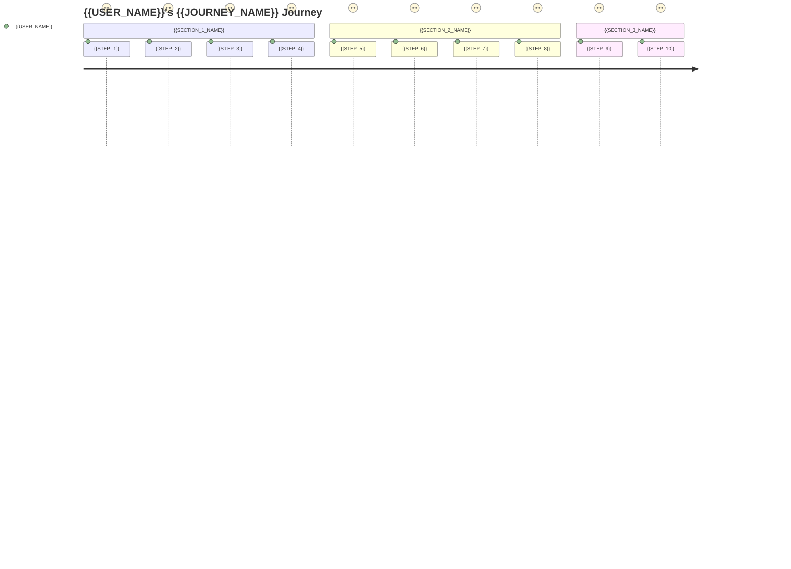

# {{JOURNEY_NAME}} User Journey

**Project:** {{PROJECT_NAME}}
**Component:** {{COMPONENT_NAME}} User Flow
**Date:** {{DATE}}
**Status:** {{STATUS}} <!-- User Journey Documentation | In Progress | Complete -->

## Overview

{{JOURNEY_OVERVIEW_DESCRIPTION}}

## Primary User Journey: {{PRIMARY_JOURNEY_NAME}}

### **Journey Map Overview**



### **Detailed Journey Steps**

#### **Phase 1: {{PHASE_1_NAME}}**

**Step 1: {{STEP_1_NAME}}**
- **User Action:** {{USER_ACTION}}
- **System Response:** {{SYSTEM_RESPONSE}}
- **User Goal:** {{USER_GOAL}}
- **Pain Points:** {{PAIN_POINTS}}
- **Opportunities:** {{OPPORTUNITIES}}
- **Satisfaction:** {{SATISFACTION_SCORE}}/5

**Step 2: {{STEP_2_NAME}}**
- **User Action:** {{USER_ACTION}}
- **System Response:** {{SYSTEM_RESPONSE}}
- **User Goal:** {{USER_GOAL}}
- **Pain Points:** {{PAIN_POINTS}}
- **Opportunities:** {{OPPORTUNITIES}}
- **Satisfaction:** {{SATISFACTION_SCORE}}/5

#### **Phase 2: {{PHASE_2_NAME}}**

**Step 3: {{STEP_3_NAME}}**
- **User Action:** {{USER_ACTION}}
- **System Response:** {{SYSTEM_RESPONSE}}
- **User Goal:** {{USER_GOAL}}
- **Pain Points:** {{PAIN_POINTS}}
- **Opportunities:** {{OPPORTUNITIES}}
- **Satisfaction:** {{SATISFACTION_SCORE}}/5

**Step 4: {{STEP_4_NAME}}**
- **User Action:** {{USER_ACTION}}
- **System Response:** {{SYSTEM_RESPONSE}}
- **User Goal:** {{USER_GOAL}}
- **Pain Points:** {{PAIN_POINTS}}
- **Opportunities:** {{OPPORTUNITIES}}
- **Satisfaction:** {{SATISFACTION_SCORE}}/5

#### **Phase 3: {{PHASE_3_NAME}}**

**Step 5: {{STEP_5_NAME}}**
- **User Action:** {{USER_ACTION}}
- **System Response:** {{SYSTEM_RESPONSE}}
- **User Goal:** {{USER_GOAL}}
- **Pain Points:** {{PAIN_POINTS}}
- **Opportunities:** {{OPPORTUNITIES}}
- **Satisfaction:** {{SATISFACTION_SCORE}}/5

## Alternative User Journeys

### **{{ALTERNATIVE_JOURNEY_1}}**
**Scenario:** {{ALTERNATIVE_SCENARIO_1}}
**Key Differences:** {{KEY_DIFFERENCES_1}}
**Success Criteria:** {{SUCCESS_CRITERIA_1}}

### **{{ALTERNATIVE_JOURNEY_2}}**
**Scenario:** {{ALTERNATIVE_SCENARIO_2}}
**Key Differences:** {{KEY_DIFFERENCES_2}}
**Success Criteria:** {{SUCCESS_CRITERIA_2}}

## User Personas

### **Primary Persona: {{PRIMARY_PERSONA_NAME}}**
- **Demographics:** {{DEMOGRAPHICS}}
- **Goals:** {{PERSONA_GOALS}}
- **Frustrations:** {{PERSONA_FRUSTRATIONS}}
- **Tech Comfort:** {{TECH_COMFORT_LEVEL}}
- **Context:** {{USAGE_CONTEXT}}

### **Secondary Persona: {{SECONDARY_PERSONA_NAME}}**
- **Demographics:** {{DEMOGRAPHICS}}
- **Goals:** {{PERSONA_GOALS}}
- **Frustrations:** {{PERSONA_FRUSTRATIONS}}
- **Tech Comfort:** {{TECH_COMFORT_LEVEL}}
- **Context:** {{USAGE_CONTEXT}}

## Touchpoints and Channels

### **Digital Touchpoints**
- **{{TOUCHPOINT_1}}:** {{TOUCHPOINT_1_DESCRIPTION}}
- **{{TOUCHPOINT_2}}:** {{TOUCHPOINT_2_DESCRIPTION}}
- **{{TOUCHPOINT_3}}:** {{TOUCHPOINT_3_DESCRIPTION}}

### **Physical Touchpoints**
- **{{PHYSICAL_TOUCHPOINT_1}}:** {{PHYSICAL_TOUCHPOINT_1_DESCRIPTION}}
- **{{PHYSICAL_TOUCHPOINT_2}}:** {{PHYSICAL_TOUCHPOINT_2_DESCRIPTION}}

## Emotions and Satisfaction

### **Emotional Journey**
```
Satisfaction Level (1-5)
     5 |     ●
     4 |   ●   ●
     3 | ●       ●
     2 |           ●
     1 |
       +--+--+--+--+--+
         1  2  3  4  5
       Journey Steps
```

### **Key Emotional Moments**
- **Peak Satisfaction:** {{PEAK_SATISFACTION_MOMENT}}
- **Lowest Point:** {{LOWEST_SATISFACTION_MOMENT}}
- **Surprise Moments:** {{SURPRISE_MOMENTS}}
- **Frustration Points:** {{FRUSTRATION_POINTS}}

## Pain Points and Opportunities

### **Critical Pain Points**
1. **{{PAIN_POINT_1}}**
   - **Impact:** {{PAIN_POINT_1_IMPACT}}
   - **Frequency:** {{PAIN_POINT_1_FREQUENCY}}
   - **Solution Opportunity:** {{PAIN_POINT_1_SOLUTION}}

2. **{{PAIN_POINT_2}}**
   - **Impact:** {{PAIN_POINT_2_IMPACT}}
   - **Frequency:** {{PAIN_POINT_2_FREQUENCY}}
   - **Solution Opportunity:** {{PAIN_POINT_2_SOLUTION}}

### **Improvement Opportunities**
1. **{{OPPORTUNITY_1}}**
   - **Potential Impact:** {{OPPORTUNITY_1_IMPACT}}
   - **Implementation Effort:** {{OPPORTUNITY_1_EFFORT}}
   - **Priority:** {{OPPORTUNITY_1_PRIORITY}}

2. **{{OPPORTUNITY_2}}**
   - **Potential Impact:** {{OPPORTUNITY_2_IMPACT}}
   - **Implementation Effort:** {{OPPORTUNITY_2_EFFORT}}
   - **Priority:** {{OPPORTUNITY_2_PRIORITY}}

## Success Metrics

### **Quantitative Metrics**
- **{{METRIC_1}}:** {{METRIC_1_TARGET}}
- **{{METRIC_2}}:** {{METRIC_2_TARGET}}
- **{{METRIC_3}}:** {{METRIC_3_TARGET}}
- **{{METRIC_4}}:** {{METRIC_4_TARGET}}

### **Qualitative Metrics**
- **{{QUALITATIVE_METRIC_1}}:** {{QUALITATIVE_METRIC_1_DESCRIPTION}}
- **{{QUALITATIVE_METRIC_2}}:** {{QUALITATIVE_METRIC_2_DESCRIPTION}}

## Implementation Considerations

### **Technical Requirements**
- {{TECHNICAL_REQUIREMENT_1}}
- {{TECHNICAL_REQUIREMENT_2}}
- {{TECHNICAL_REQUIREMENT_3}}

### **Business Requirements**
- {{BUSINESS_REQUIREMENT_1}}
- {{BUSINESS_REQUIREMENT_2}}
- {{BUSINESS_REQUIREMENT_3}}

### **Design Requirements**
- {{DESIGN_REQUIREMENT_1}}
- {{DESIGN_REQUIREMENT_2}}
- {{DESIGN_REQUIREMENT_3}}

## Validation Plan

### **User Testing**
- **Test Method:** {{TEST_METHOD}}
- **Participants:** {{PARTICIPANT_CRITERIA}}
- **Test Scenarios:** {{TEST_SCENARIOS}}
- **Success Criteria:** {{TEST_SUCCESS_CRITERIA}}

### **Analytics Tracking**
- **Events to Track:** {{ANALYTICS_EVENTS}}
- **Conversion Funnels:** {{CONVERSION_FUNNELS}}
- **Behavioral Metrics:** {{BEHAVIORAL_METRICS}}

## Related Documentation

- [UI/UX Specifications](../UI-SPECIFICATIONS.md)
- [Wireframes](../wireframes/{{WIREFRAME_FILE}})
- [User Requirements](../../REQUIREMENTS.md)
- [User Stories](../../USER-STORIES.md)

---

**Template Usage:**
1. Replace all {{PLACEHOLDER}} values with actual journey details
2. Create supporting wireframes and interaction documentation
3. Validate journey with user research and testing
4. Update satisfaction scores based on user feedback
5. Remove this template usage section when complete
